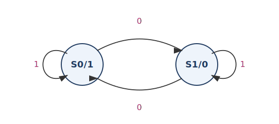
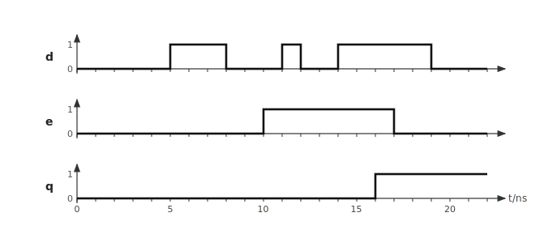
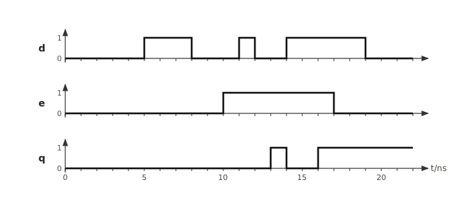

# Aufgabe 1

## Aufgabenstellung

Gegeben ist ein Multiplexer mit vier Dateneingängen (a, b, c, d), zwei Auswahleingängen (sel[0], sel[1]) und einem Ausgang o. Der Ausgang wird je nach Auswahl wie folgt belegt.

| sel[0] | sel[1] | o |
|:---:|:---:|:---:|
| 0 | 0 | a |
| 0 | 1 | b |
| 1 | 0 | c |
| 1 | 1 | d |

* 1.1 Entity `mux4` mit `STD_LOGIC` bzw. `STD_LOGIC_VECTOR`.
* 1.2 Architektur `behavior` ausschließlich mit sequenziellen Anweisungen.
* 1.3 Architektur `data_flow` mit einer Signalzuweisung.
* 1.4 Konfiguration, die für die Simulation die Architektur `behavior` festlegt.
* 1.5 Welche Architektur nimmt der Simulator ohne Konfiguration?

## Lösung

```VHDL
LIBRARY ieee;
USE ieee.std_logic_1164.ALL;
--1.1
ENTITY mux4 IS
    PORT (  a, b, c, d  : IN STD_LOGIC;
            sel         : IN STD_LOGIC_VECTOR(0 TO 1); -- (0 TO 1) damit sel(0)=sel[0], sel(1)=sel[1] wie in der Tabelle
            o           : OUT STD_LOGIC);
END ENTITY mux4; 
--1.2
ARCHITECTURE behavioral OF mux4 IS 
BEGIN
    PROCESS(a, b, c, d, sel)
    BEGIN
        IF (sel(0) = '0' AND sel(1) = '0') THEN   
            o <= a;
        ELSIF (sel(0) = '0' AND sel(1) = '1') THEN 
            o <= b;
        ELSIF (sel(0) = '1' AND sel(1) = '0') THEN  
            o <= c;
        ELSIF (sel(0) = '1' AND sel(1) = '1') THEN  -- sel[0]=1, sel[1]=1
            o <= d;
        ELSE
            o <= 'X';                               -- STD_LOGIC kann auch andere Werte annehmen
        END IF;
    END PROCESS;
END ARCHITECTURE behavioral;
--1.3
ARCHITECTURE data_flow OF mux4 IS 
BEGIN
    o <= ((NOT sel(0)   AND NOT sel(1)      AND a) OR
          (NOT sel(0)   AND     sel(1)      AND b) OR
          (    sel(0)   AND NOT sel(1)      AND c) OR
          (    sel(0)   AND     sel(1)      AND d));
    -- oder 
    -- WITH sel SELECT
    --     o <= a WHEN "00",
    --          b WHEN "01",
    --          c WHEN "10",
    --          d WHEN "11",
    --          'X' WHEN OTHERS;
    -- oder:
    -- o <= a WHEN sel = "00" ELSE
    --      b WHEN sel = "01" ELSE
    --      c WHEN sel = "10" ELSE
    --      d WHEN sel = "11" ELSE
    --      'X';
END ARCHITECTURE data_flow;
-- 1.4
CONFIGURATION cfg_mux4 OF mux4 IS
    FOR behavioral     
    END FOR;
END CONFIGURATION cfg_mux4; 
-- 1.5 Die zuletzt analysierte Architektur wird verwendet. In diesem Fall ist dies data_flow.
```
# Aufgabe 2

## Aufgabenstellung

Gegeben ist das Zustandsdiagramm eines sequenziellen, synchronen Moore-Automaten. Bei gesetztem Reset (`='1'`) geht der Automat zur steigenden Taktflanke in den Zustand S0.



Der Eingang schaltet bei `0` zwischen den Zuständen um und hält bei `1`. Die Ausgabe ist Moore, hängt also nur vom Zustand ab, S0 gibt 1 aus und S1 gibt 0 aus.

* 2.1 Entity für den Automaten, Ein- und Ausgänge vom Datentyp `BIT`.
* 2.2 Architektur für den Automaten.

## Lösung

```VHDL
LIBRARY ieee;
USE ieee.std_logic_1164.ALL;

ENTITY mA IS
    PORT(a, clk, reset : IN  BIT;
         z             : OUT BIT);
END ENTITY mA;

ARCHITECTURE behavioral OF mA IS
    TYPE stateT IS (S0, S1);
    SIGNAL state: stateT;
BEGIN
    PROCESS(clk) IS
    BEGIN
        -- clk ist BIT, daher clk'EVENT AND clk='1' statt RISING_EDGE
        -- (RISING_EDGE ist in VHDL-93 nur fuer STD_(U)LOGIC definiert). 
        IF (clk'EVENT AND clk = '1') THEN
            IF reset = '1' THEN
                state <= S0;
            ELSE
                CASE state IS
                    WHEN S0 => IF a = '0' THEN state <= S1; ELSE state <= S0; END IF; -- Zustand S0, nicht 0
                    WHEN S1 => IF a = '0' THEN state <= S0; ELSE state <= S1; END IF; -- Zustand S1, nicht 1
                END CASE;
            END IF;
        END IF;
    END PROCESS;

    PROCESS (state) IS
    BEGIN
        CASE state IS
            WHEN S0 => z <= '1';
            WHEN S1 => z <= '0';
        END CASE;
    END PROCESS;
END ARCHITECTURE behavioral;
```
# Aufgabe 3

## Aufgabenstellung

Gegeben ist folgendes VHDL-Modell.

```vhdl
ENTITY xxx IS
    PORT(d, e : IN  BIT;
         q    : OUT BIT);
END xxx;

ARCHITECTURE behavior OF xxx IS
BEGIN
    PROCESS(e, d)
    BEGIN
        IF (e = '1') THEN
            q <= d AFTER 2 ns;   -- Zeile *
        END IF;
    END PROCESS;
END behavior;
```

* 3.1 Gib den zeitlichen Verlauf des Ausgangs q bei den gegebenen Eingangsstimuli an.
* 3.2 Welcher Verlauf von q ergibt sich, wenn in Zeile * `q <= TRANSPORT d AFTER 2 ns;` steht.
* 3.3 Schreibe eine Testbench, die das Modell instanziiert und die gegebenen Stimuli anlegt.

## 3.1 inertiale Verzögerung

`q <= d AFTER 2 ns` ist inertial, das ist das Standardverhalten. Pulse, die kürzer als die Verzögerung von 2 ns sind, werden verschluckt. Außerdem ändert sich q nur, solange e='1' ist (10 ns bis 17 ns), sonst hält der Prozess den alten Wert.



Der kurze d-Puls von 11 ns bis 12 ns (1 ns breit) wird gefiltert. Der d-Wechsel auf '1' bei 14 ns erreicht q um 2 ns verzögert bei 16 ns. Der d-Puls von 5 ns bis 8 ns wirkt nicht, weil dort e='0' ist.

## 3.2 transport-Verzögerung

Mit `TRANSPORT` werden alle Wechsel weitergegeben, also auch kurze Pulse.



Der d-Puls von 11 ns bis 12 ns erscheint hier als kurzer q-Puls von 13 ns bis 14 ns, der Wechsel bei 14 ns wieder als q='1' ab 16 ns.

## 3.3 Testbench

```vhdl
ENTITY tb_xxx IS                 -- Testbench hat keine Ports
END ENTITY tb_xxx;

ARCHITECTURE testbench OF tb_xxx IS
    COMPONENT xxx
        PORT (  d, e : IN  BIT;
                q    : OUT BIT);
    END COMPONENT;

    SIGNAL a, b, c : BIT;
BEGIN
    G1: xxx PORT MAP (d => a, e => b, q => c);   -- Zuordnung mit =>, nicht <=, und mit ; am Ende

    -- Variante 1, nebenlaeufige Stimuli (ausserhalb eines Prozesses):
    -- a <= '0', '1' after 5 ns, '0' after 8 ns, '1' after 11 ns,
    --           '0' after 12 ns, '1' after 14 ns, '0' after 19 ns;
    -- b <= '0', '1' after 10 ns, '0' after 17 ns, '1' after 22 ns;

    -- Variante 2, ein Prozess mit WAIT FOR (nur EINE Variante darf aktiv sein):
    PROCESS IS
    BEGIN
        a <= '0'; b <= '0';
        WAIT FOR 5 ns;  a <= '1';
        WAIT FOR 3 ns;  a <= '0';
        WAIT FOR 2 ns;  b <= '1';
        WAIT FOR 1 ns;  a <= '1';
        WAIT FOR 1 ns;  a <= '0';
        WAIT FOR 2 ns;  a <= '1';
        WAIT FOR 3 ns;  b <= '0';
        WAIT FOR 2 ns;  a <= '0';
        WAIT FOR 3 ns;  b <= '1';
        WAIT;                       -- haelt den Prozess an, sonst Endlosschleife
    END PROCESS;
END ARCHITECTURE testbench;
```

# Aufgabe 4 
``` VHDL
LIBRARY ieee;
USE ieee.std_logic_1164.all;

ENTITY xor3 IS
    PORT(   a, b, c : IN STD_LOGIC;
            o       : OUT STD_LOGIC);
END xor3; 

ARCHITECTURE data_flow OF xor3 IS
BEGIN
    o <= a XOR b XOR c;
END data_flow;

ARCHITECTURE behavioral OF xor3 IS 
BEGIN
    PROCESS (a,b,c) IS
    BEGIN
        IF (a/='0' AND a/='1') OR (b/='0' AND b/='1') OR (c/='0' AND c/='1') THEN
            o <= 'X';
        ELSIF (a='0' AND b='0' AND c='1') OR (a='0' AND b='1' AND c='0') OR (a='1' AND b='0' AND c='0') OR (a='1' AND b='1' AND c='1') THEN
            o <= '1';
        ELSE
            o <= '0';
        END IF;
    END PROCESS;   
END ARCHITECTURE behavioral;

ENTITY hamming_code IS
    PORT(   d:  IN STD_LOGIC_VECTOR (1 TO 4);
            c:  OUT STD_LOGIC_VECTOR (1 TO 7));
END hamming_code;

ARCHITECTURE structural OF hamming_code IS
COMPONENT xor3
    PORT(   a,b,c   : IN STD_LOGIC;
            o       : OUT STD_LOGIC);
END COMPONENT;
-- IST DAS HIER NÖTIG
    FOR U1:xor3 USE ENTITY work.xor3(data_flow);
    FOR U2:xor3 USE ENTITY work.xor3(data_flow);
    FOR U3:xor3 USE ENTITY work.xor3(data_flow);
BEGIN
    U1: xor3 port map(d(1),d(2),d(4),c(1));
    U2: xor3 port map(d(1),d(3),d(4),c(2));
    U3: xor3 port map(d(2),d(3),d(4),c(4));
    c(3) <= d(1);
    c(5) <= d(2);
    c(6) <= d(3);
    c(7) <= d(4);
END structural;
```