# Aufgaben

## Inhaltsverzeichnis

- [Aufgabe 1: Entity eines Adders deklarieren](#aufgabe-1-entity-eines-adders-deklarieren)
- [Aufgabe 2: Architecture eines Adders deklarieren](#aufgabe-2-architecture-eines-adders-deklarieren)
- [Aufgabe 3: Erstelle einen OR-Baustein](#aufgabe-3-erstelle-einen-or-baustein)
- [Aufgabe 4: Erstelle einen Volladdierer](#aufgabe-4-erstelle-einen-volladdierer)
- [Aufgabe 5: Erstelle eine Architecture eines Adders (sequenziell)](#aufgabe-5-erstelle-eine-architecture-eines-adders-sequenziell)
- [Aufgabe 6: 4-aus-16-Decoder mit Schleife](#aufgabe-6-4-aus-16-decoder-mit-schleife)
- [Aufgabe 7: Delay-Modelle](#aufgabe-7-delay-modelle)
    - [Aufgabe 7.1 Unit-Delay-Modell für eine ARCHITECTURE](#aufgabe-71-unit-delay-modell-für-eine-architecture)
    - [Aufgabe 7.2 Unit-Delay-Modell für alle ENTITY´s (GENERIC)](#aufgabe-72-unit-delay-modell-für-alle-entitys-generic)
    - [Aufgabe 7.3 Unit-Delay-Modell für GENERICMAP (GENERIC)](#aufgabe-73-unit-delay-modell-für-genericmap-generic)
    - [Aufgabe 7.4 Flankenabhängige Verzögerung](#aufgabe-74-flankenabhängige-verzögerung)
    - [Aufgabe 7.5 Lastabhängige Verzögerung](#aufgabe-75-lastabhängige-verzögerung)
- [Aufgabe 8: Erstelle ein D-FlipFlop](#aufgabe-8-erstelle-ein-d-flipflop)
- [Aufgabe 9: Erstelle einen INT TO STD_LOGIC_VECTOR mit einer Function](#aufgabe-9-erstelle-einen-int-to-std_logic_vector-mit-einer-function)
- [Aufgabe 10: Prozedur-Aufrufe und Parameter-Assoziation](#aufgabe-10-prozedur-aufrufe-und-parameter-assoziation)
- [Aufgabe 11: Überladen von Operatoren (Operator Overloading)](#aufgabe-11-überladen-von-operatoren-operator-overloading)
- [Aufgabe 12: Ripple-Carry-Addierer mit n Addierern](#aufgabe-12-ripple-carry-addierer-mit-n-addierern)
- [Aufgabe 13: Konvertierung von Porttypen mit CONFIGURATION](#aufgabe-13-konvertierung-von-porttypen-mit-configuration)
- [Aufgabe 14: Decoder mit Schieberoperation](#aufgabe-14-decoder-mit-schieberoperation)
- [Aufgabe 15: Single-Port- und Dual-Port-RAM](#aufgabe-15-single-port--und-dual-port-ram)
    - [Aufgabe 15.1 Single-Port-RAM (synchroner Block-RAM)](#aufgabe-151-single-port-ram-synchroner-block-ram)
    - [Aufgabe 15.2 Dual-Port-RAM](#aufgabe-152-dual-port-ram)
- [Aufgabe 16: Zustandsautomat Modulo-4-Zähler (FSM)](#aufgabe-16-zustandsautomat-modulo-4-zähler-fsm)
    - [Aufgabe 16.1 Moore-Automat (synchroner Reset)](#aufgabe-161-moore-automat-synchroner-reset)
    - [Aufgabe 16.2 Mealy-Automat (Ausgang)](#aufgabe-162-mealy-automat-ausgang)
- [Aufgabe 17: Optimierung (Mittelwert aus 4 Werten)](#aufgabe-17-optimierung-mittelwert-aus-4-werten)
    - [Aufgabe 17.1 Iterativ (wenig Fläche)](#aufgabe-171-iterativ-wenig-fläche)
    - [Aufgabe 17.2 Pipeline (hoher Durchsatz)](#aufgabe-172-pipeline-hoher-durchsatz)
    - [Aufgabe 17.3 Geringe Latenz](#aufgabe-173-geringe-latenz)
    - [Aufgabe 17.4 FIR-Filter mit langem kritischen Pfad](#aufgabe-174-fir-filter-mit-langem-kritischen-pfad)
    - [Aufgabe 17.5 FIR-Filter mit eingefügten Registern](#aufgabe-175-fir-filter-mit-eingefügten-registern)
    - [Aufgabe 17.6 Parallelismus (8×8-Multiplizierer)](#aufgabe-176-parallelismus-88-multiplizierer)
    - [Aufgabe 17.7 Vereinfachen logischer Strukturen (Prioritätsencoder)](#aufgabe-177-vereinfachen-logischer-strukturen-prioritätsencoder)
    - [Aufgabe 17.8 Balancierung des kritischen Pfads](#aufgabe-178-balancierung-des-kritischen-pfads)
    - [Aufgabe 17.9 Unrolling the Pipeline (serieller Multiplizierer)](#aufgabe-179-unrolling-the-pipeline-serieller-multiplizierer)
    - [Aufgabe 17.10 Resource Sharing](#aufgabe-1710-resource-sharing)
    - [Aufgabe 17.11 Einfluss von Reset (SRL16)](#aufgabe-1711-einfluss-von-reset-srl16)
- [Aufgabe 18: PSL-Assertions (PRÜFUNG)](#aufgabe-18-psl-assertions-prüfung)
    - [Aufgabe 18.1 Zähler mit drei Assertions (PRÜFUNG)](#aufgabe-181-zähler-mit-drei-assertions-prüfung)
    - [Aufgabe 18.2 I2C-Start und fehlendes Acknowledge (PRÜFUNG)](#aufgabe-182-i2c-start-und-fehlendes-acknowledge-prüfung)

## Aufgabe 1: Entity eines Adders deklarieren

```vhdl
ENTITY adder IS
    PORT (  x, y : IN  BIT;
            z, c : OUT BIT);
END ENTITY adder;
-- erstellt die Schnittstelle nach außen
```

## Aufgabe 2: Architecture eines Adders deklarieren

```vhdl
ARCHITECTURE data_flow OF adder IS
BEGIN
    z <= ((NOT x) AND y) OR (x AND (NOT y));
    c <= x AND y;
END ARCHITECTURE data_flow;
-- das sind nebenläufige Anweisungen
```

```vhdl
-- Alternativ mit SIGNAL
ARCHITECTURE data_flow OF adder IS
    SIGNAL a, b : BIT;
BEGIN
    a <= (NOT x) AND y;
    b <= x AND (NOT y);   -- vorher fälschlich identisch mit a
    z <= a OR b;          -- Summe = a ODER b (vorher AND)
    c <= x AND y;
END ARCHITECTURE data_flow;


-- Frage: Name der Architecture ist hier data_flow ...
--        und mit "OF adder" wird die Architecture mit der Entity adder verbunden?
--        --> ja. data_flow ist der Architecture-Name, "OF adder" bindet sie an die Entity.
--            (Name oben und bei END muss gleich sein.)


-- Frage: Sind alle Signalzuweisungen hier nebenläufig?
--        --> ja, alle Signalzuweisungen im Architecture-Body sind nebenläufig (concurrent).

```
```vhdl
-- Und wie sieht es mit WHEN ELSE aus?
ARCHITECTURE data_flow OF adder IS
BEGIN
    z <= '1' WHEN x = '1' AND y = '0' ELSE
         '1' WHEN x = '0' AND y = '1' ELSE
         '0';
    c <= '1' WHEN x = '1' AND y = '1' ELSE   -- vorher: x = '1' AND x = '1'
         '0';
END ARCHITECTURE data_flow;
-- Frage: Ist das hier auch nebenläufig?
--        --> ja. Bedingte Signalzuweisungen (WHEN ELSE) außerhalb eines Process
--            sind ebenfalls nebenläufig. Reihenfolge spielt keine Rolle.
```

## Aufgabe 3: Erstelle einen OR-Baustein

```vhdl
ENTITY or2 IS
    PORT (  a, b : IN  BIT;
            r : OUT BIT);
END or2 adder;
```
```vhdl
ARCHITECTURE data_flow OF or2 IS
BEGIN
	r <= a OR b;
END ARCHITECTURE data_flow
```

## Aufgabe 4: Erstelle einen Volladdierer

```vhdl
ENTITY adder3 IS
    PORT (  a, b, c : IN  BIT;
            z, co : OUT BIT);
END ENTITY adder;

--  mit PORTMAP :
ARCHITECTURE  structure OF adder3 IS
	-- COMPONENT am besten aus Entity kopieren und Entity in COMPONENT umbenennen
	COMPONENT adder IS
    		PORT (  x, y : IN  BIT;
            		z, c : OUT BIT);
	END COMPONENT adder;

	COMPONENT or2 IS
    		PORT (  a, b : IN  BIT;
            		r : OUT BIT);
	COMPONENT or2 adder;

	
	SIGNAL t_sum, t_c1,t_c2: BIT;
BEGIN
	G1: adder PORT MAP(a,b,t_sum, t_c1);
	G2: adder PORT MAP(t_sum, c, z, t_c2)
	G3: or2   PORT MAP(t_c2, t_c1, co)
END  ARCHITECTURE structure;
```
```vhdl
-- direkt mit Instantiierung (VHDL 93)

ARCHITECTURE  structure OF adder3 IS
	SIGNAL t_sum, t_c1,t_c2: BIT;
BEGIN
	G1: ENTITY work.adder(data_flow) PORT MAP (a,b, t_sum, t_c1);
	G2: ENTITY work.adder(data_flow) PORT MAP (t_sum, c, z, t_c2);
	G3: ENTITY work.or2(data_flow)   PORT MAP (t_c2, t_c1, co);
END  ARCHITECTURE structure;
```

## Aufgabe 5: Erstelle eine Architecture eines Adders (sequenziell)
```vhdl
ENTITY adder IS
    PORT (  x, y : IN  BIT;
            z, c : OUT BIT);
END ENTITY adder;
```
```vhdl
ARCHITECTURE algorithm OF adder IS
BEGIN
    PROCESS (x, y) IS
    BEGIN
        IF ((x = '0' AND y = '1') OR (x = '1' AND y = '0')) THEN
            z <= '1'; c <= '0';
        ELSIF (x = '1' AND y = '1') THEN
            z <= '0'; c <= '1';
        ELSE
            z <= '0'; c <= '0';
        END IF;
    END PROCESS;
END ARCHITECTURE algorithm;
```

## Aufgabe 6: 4-aus-16-Decoder mit Schleife
```vhdl
ENTITY decoder IS
    PORT (  in_array  : IN  BIT_VECTOR(3 DOWNTO 0);
            out_array : OUT BIT_VECTOR(15 DOWNTO 0));
END ENTITY decoder;
```
```vhdl
ARCHITECTURE algorithm OF decoder IS
BEGIN
    PROCESS (in_array)
        VARIABLE sum : INTEGER RANGE 0 TO 15;
    BEGIN
        -- Eingang in eine Ganzzahl umrechnen
        sum := 0;
        FOR i IN 0 TO 3 LOOP
            IF in_array(i) = '1' THEN
                sum := sum + 2**i;   -- Bit i hat die Wertigkeit 2^i
            END IF;
        END LOOP;

        -- alle Ausgänge auf 0 setzen
        FOR i IN 0 TO 15 LOOP
            out_array(i) <= '0';
        END LOOP;

        -- den passenden Ausgang aktivieren
        out_array(sum) <= '1';
    END PROCESS;
END ARCHITECTURE algorithm;
```
## Aufgabe 7: Delay-Modelle

### Aufgabe 7.1 Unit-Delay-Modell für eine ARCHITECTURE
```vhdl
LIBRARY ieee;
USE ieee.std_logic_1164.ALL;

ENTITY and2 IS
    PORT(x,y:   IN STD_LOGIC;
        z:      OUT STD_LOGIC);
END ENTITY and2;
```
```vhdl
ARCHITECTURE const_delay OF and2 IS
BEGIN  
    PROCESS(x,y) IS
        CONSTANT delay: TIME := 1 ns;
    BEGIN
        z <= (x AND y) AFTER delay;
    END PROCESS;
END ARCHITECTURE const_delay;
 ```

### Aufgabe 7.2 Unit-Delay-Modell für alle ENTITY´s (GENERIC)

 ```vhdl
LIBRARY ieee;
USE ieee.std_logic_1164.ALL;

ENTITY and2 IS
    GENERIC(delay : TIME := 1 ns);
    PORT(x,y:   IN STD_LOGIC;
        z:      OUT STD_LOGIC);
END ENTITY and2;
```
```vhdl
ARCHITECTURE generic_delay OF and2 IS
BEGIN  
    PROCESS(x,y) IS
    BEGIN
        z <= (x AND y) AFTER delay;
    END PROCESS;
END ARCHITECTURE generic_delay;
 ```

### Aufgabe 7.3 Unit-Delay-Modell für GENERICMAP (GENERIC)

 ```vhdl
LIBRARY ieee;
USE ieee.std_logic_1164.ALL;

ENTITY and3 IS
    PORT(a,b,c:   IN STD_LOGIC;
         o:      OUT STD_LOGIC);
END ENTITY and3;
```
```vhdl
ARCHITECTURE struct OF and3 IS
    COMPONENT and2 IS
        GENERIC(delay : TIME);
        PORT(x,y:   IN STD_LOGIC;
            z:      OUT STD_LOGIC);
    END COMPONENT and2;

    SIGNAL t: STD_LOGIC;
BEGIN  
    G1: and2 GENERIC MAP(2 ns) PORT MAP (a,b,t);
    G2: and2 GENERIC MAP(2 ns) PORT MAP (t,c,o);
END ARCHITECTURE struct;
 ```

### Aufgabe 7.4 Flankenabhängige Verzögerung

```vhdl
ENTITY and2 IS
    GENERIC(tlh, thl : TIME := 0 ns);   -- transition delays (low->high, high->low)
    PORT(x, y : IN  BIT;
         z    : OUT BIT);
END ENTITY and2;
```
```vhdl
ARCHITECTURE transition_delay OF and2 IS
BEGIN
    PROCESS(x, y) IS
        VARIABLE and_new, and_old : BIT := '0';
    BEGIN
        and_new := x AND y;
        IF and_new = '1' AND and_old = '0' THEN       -- steigende Flanke
            z <= and_new AFTER tlh;
        ELSIF and_new = '0' AND and_old = '1' THEN    -- fallende Flanke
            z <= and_new AFTER thl;
        END IF;
        and_old := and_new;
    END PROCESS;
END ARCHITECTURE transition_delay;
```

### Aufgabe 7.5 Lastabhängige Verzögerung

 ```vhdl
ENTITY and2 IS
    GENERIC(tlh_factor, thl_factor : TIME := 0 ns;
            load_value             : REAL := 1.0);
    PORT(x,y: IN BIT;
         z: OUT BIT);
END ENTITY and2;
```
```vhdl
ARCHITECTURE load_delay OF and2 IS
BEGIN
    PROCESS(x,y) IS
        VARIABLE and_new, and_old : BIT := '0';
        CONSTANT base_delay       : TIME := 500 ps;
    BEGIN
        and_new := x AND y;
        IF and_new = '1' AND and_old = '0' THEN          -- steigende Flanke (0 -> 1)
            z <= and_new AFTER (base_delay + tlh_factor * load_value);
        ELSIF and_new = '0' AND and_old = '1' THEN       -- fallende Flanke (1 -> 0)
            z <= and_new AFTER (base_delay + thl_factor * load_value);
        END IF;
        and_old := and_new;   -- aktuellen Zustand für den nächsten Aufruf merken
    END PROCESS;
END ARCHITECTURE load_delay;
 ```

## Aufgabe 8: Erstelle ein D-FlipFlop

 ```VHDL
LIBRARY ieee;
USE ieee.std_logic_1164.ALL;

ENTITY dff IS
    PORT(clk, rest, d: IN  STD_LOGIC;
         q    : OUT STD_LOGIC
    );
END ENTITY dff;
```
```vhdl
ARCHITECTURE behaviour OF dff IS
BEGIN
    PROCESS(clk) IS -- NUR clk in der Sensitivity-List!
    BEGIN
        -- Der Prozess reagiert NUR auf die Taktflanke
        IF rising_edge(clk) THEN 
            -- Im Moment der Taktflanke wird zuerst 'rest' geprüft
            IF (rest = '1') THEN
                q <= '1'; -- Synchroner Ausgangszustand (Set)
            ELSE
                q <= d;   -- Normaler D-FF-Betrieb (Wert von d übernehmen)
            END IF;       
        END IF;
    END PROCESS;
END ARCHITECTURE behaviour;
```
```vhdl
ARCHITECTURE delays OF dff IS
BEGIN
    PROCESS(clk) IS
        CONSTANT thl : TIME := 2 ns; -- Verzögerung High-to-Low
        CONSTANT tlh : TIME := 1 ns; -- Verzögerung Low-to-High
        
        -- Wir brauchen zwei Variablen: Eine für den alten Zustand, eine für die Kombination
        VARIABLE state_old : STD_LOGIC := '0'; 
        VARIABLE change    : STD_LOGIC_VECTOR(1 DOWNTO 0);
    BEGIN
        IF rising_edge(clk) THEN
            -- Wir kombinieren: [Alter Zustand] & [Neuer Wunschzustand d]
            change := state_old & d;
            
            CASE change IS
                WHEN "00" | "11" => 
                    NULL; -- Keine Änderung, tu nichts
                    
                WHEN "10" => 
                    state_old := d;       -- Aktualisiere den internen Zustand
                    q <= d AFTER thl;     -- Schalte verzögert um 2 ns auf '0'
                    
                WHEN "01" => 
                    state_old := d;       -- Aktualisiere den internen Zustand
                    q <= d AFTER tlh;     -- Schalte verzögert um 1 ns auf '1'
                    
                WHEN OTHERS => 
                    NULL; -- Wichtig bei STD_LOGIC für undefinierte Zustände (U, X, Z)
            END CASE;
        END IF;
    END PROCESS;
END ARCHITECTURE delays;
```

## Aufgabe 9: Erstelle einen INT TO STD_LOGIC_VECTOR mit einer Function

### 9.1. Der Algorithmus (Schritt für Schritt)

1. **Eingabe:** Eine Ganzzahl (`value`) und die gewünschte Bitbreite (`width`) des Zielvektors.
2. **Initialisierung:**
    * Lege eine Arbeitskopie der Zahl an (Variable `v`).
    * Erstelle einen leeren Zielvektor (`result`) mit der Länge `width - 1 DOWNTO 0`.
3. **Schleife:** Durchlaufe den Zielvektor von **rechts nach links** (vom niederwertigsten Bit an Position 0 bis zum höchsten Bit).
    * **Schritt A (Rest bestimmen):** Prüfe den Rest der Division durch 2. Wenn die Zahl ungerade ist (Rest = 1), setze das aktuelle Bit auf '1'. Wenn sie gerade ist (Rest = 0), setze das Bit auf '0'.
    * **Schritt B (Zahl verkleinern):** Führe eine Ganzzahldivision durch 2 durch (`v / 2`). Die Nachkommastellen fallen bei Ganzzahlen automatisch weg.
4. **Ausgabe:** Wenn alle Bit-Positionen abgearbeitet sind, gib den fertigen Vektor zurück.

---

### 9.2. Hinweis zur Bitbreite (width)

Mathematisch reichen für die Zahl 5 zwar 3 Bit (5 dezimal = 101 binär), aber in der Digitaltechnik werden Vektoren meist an feste Busbreiten (z. B. 4, 8, 16 Bit) angepasst. Die Funktion füllt fehlende Stellen links einfach automatisch mit Nullen ('0') auf:
* Bei `width = 3` -> "101" (Mindestbreite)
* Bei `width = 4` -> "0101"
* Bei `width = 8` -> "00000101"

---

### 9.3. Beispiel: Umwandlung von value = 10 mit width = 4

Der Zielvektor hat die Indizes 3 DOWNTO 0. Die Schleife läuft rückwärts von Index 0 bis 3:

* **1. Durchlauf (Index 0):**
    * Aktueller Wert: `v = 10` (gerade)
    * Rechnung: 10 MOD 2 = 0 -> **Bit an Position 0 wird '0'**
    * Nächster Wert: `v = 10 / 2 = 5`

* **2. Durchlauf (Index 1):**
    * Aktueller Wert: `v = 5` (ungerade)
    * Rechnung: 5 MOD 2 = 1 -> **Bit an Position 1 wird '1'**
    * Nächster Wert: `v = 5 / 2 = 2`

* **3. Durchlauf (Index 2):**
    * Aktueller Wert: `v = 2` (gerade)
    * Rechnung: 2 MOD 2 = 0 -> **Bit an Position 2 wird '0'**
    * Nächster Wert: `v = 2 / 2 = 1`

* **4. Durchlauf (Index 3):**
    * Aktueller Wert: `v = 1` (ungerade)
    * Rechnung: 1 MOD 2 = 1 -> **Bit an Position 3 wird '1'**
    * Nächster Wert: `v = 1 / 2 = 0`

**Endergebnis für die 10:** "1010"

### 9.4 VHDL-Code
```VHDL
LIBRARY ieee;
USE ieee.std_logic_1164.ALL;

ENTITY conv IS
    PORT (
        x : IN INTEGER;
        z : OUT STD_LOGIC_VECTOR(7 DOWNTO 0)
    );
END ENTITY conv;
```

```VHDL
ARCHITECTURE behavioral OF conv IS
    -- Funktion einheitlich benannt und auf DOWNTO umgestellt
    FUNCTION to_std_logic_vector (value, width : INTEGER) RETURN STD_LOGIC_VECTOR IS
        VARIABLE v      : INTEGER := value;
        VARIABLE result : STD_LOGIC_VECTOR(width - 1 DOWNTO 0); -- Jetzt passend zu OUT-Port z
    BEGIN
        -- Da result nun DOWNTO ist, fängt 'RANGE automatisch beim LSB (0) an zu zählen
        FOR i IN result'RANGE LOOP
            IF v MOD 2 = 1 THEN
                result(i) := '1';
            ELSE
                result(i) := '0';
            END IF;
            
            IF v >= 0 THEN
                v := v / 2; -- Semikolon ergänzt
            ELSE 
                v := (v - 1) / 2; -- crashes if v = -2**31
            END IF; -- Semikolon ergänzt
        END LOOP;
        
        RETURN result;
    END FUNCTION to_std_logic_vector; -- Name korrigiert

BEGIN
    PROCESS (x) IS
    BEGIN
        -- Name korrigiert und Semikolon ergänzt
        z <= to_std_logic_vector(x, 8); 
    END PROCESS;
END ARCHITECTURE behavioral;
```

## Aufgabe 10: Prozedur-Aufrufe und Parameter-Assoziation

Dieses Beispiel zeigt die Definition einer Prozedur innerhalb eines Prozesses sowie die verschiedenen legalen und illegalen Arten, Parameter zu übergeben (Positional, Default und Named Association).

```vhdl
-- Deklaration von Signalen außerhalb des Prozesses
SIGNAL a, b : BIT;
SIGNAL ab   : BIT_VECTOR(1 DOWNTO 0);

PROCESS IS
    -- Definition der Prozedur im deklarativen Teil des Prozesses
    PROCEDURE assign (
        ip    : BIT_VECTOR;          -- Erforderlicher Parameter (kein Default)
        pause : TIME := 10 ns        -- Optionaler Parameter mit Default-Wert
    ) IS
    BEGIN
        a <= ip(0);
        b <= ip(1);
        WAIT FOR pause;
    END PROCEDURE assign;

BEGIN
    -- 1. Positional Association (Zuweisung nach Reihenfolge)
    assign(ab, 5 ns); 

    -- 2. Default Value (Nutzt den Standardwert pause = 10 ns)
    assign(ab); 

    -- 3. ILLEGAL / Geht nicht! (Der Parameter 'ip' hat keinen Default-Wert)
    -- assign(); 

    -- 4. Named Association (Zuweisung explizit über den Namen, Reihenfolge egal)
    assign(pause => 3 ns, ip => ab); 

END PROCESS;
```

## Aufgabe 11: Überladen von Operatoren (Operator Overloading)

Dieses Beispiel zeigt, wie man bestehende VHDL-Standardoperatoren (wie `and` oder `or`) für eigene, benutzerdefinierte Datentypen verfügbar macht und die Logik effizient über eine Nachschlagetabelle (Look-up-Table) löst.

```vhdl
-- Beispiel 1: Deklarations-Beispiele für das Überladen des "or"-Operators
FUNCTION "or" (a, b: BIT) RETURN BIT;
FUNCTION "or" (a, b: BOOLEAN) RETURN BOOLEAN;
FUNCTION "or" (a, b: BIT_VECTOR) RETURN BIT_VECTOR;

-- Beispiel 2: Überladen des "and"-Operators für einen 3-wertigen Typ via Look-up-Table
TYPE tri IS ('0', '1', 'Z');

FUNCTION "and" (left, right: tri) RETURN tri IS
    -- Definition eines 2D-Arrays, dessen Indizes selbst vom Typ 'tri' sind
    TYPE tri_array IS ARRAY (tri, tri) OF tri;
    
    -- Die Wahrheitstabelle (Look-up-Table) für alle 9 Kombinationen
    CONSTANT and_table: tri_array := ( 
        ('0', '0', '0'),  -- wenn left = '0' (für right = '0', '1', 'Z')
        ('0', '1', '1'),  -- wenn left = '1' (für right = '0', '1', 'Z')
        ('0', '1', '1')   -- wenn left = 'Z' (für right = '0', '1', 'Z')
    );
BEGIN
    -- Das Ergebnis wird direkt aus der Tabelle an den Kreuzungspunkten gelesen
    RETURN and_table(left, right);
END FUNCTION "and";
```

## Aufgabe 12: Ripple-Carry-Addierer mit n Addierern
```vhdl
LIBRARY ieee;
USE ieee.std_logic_1164.all;

ENTITY nbitadder IS
    GENERIC(n : NATURAL := 4);
    PORT(   a, b : IN  STD_ULOGIC_VECTOR(n-1 DOWNTO 0);
            cin  : IN  STD_ULOGIC;
            sum  : OUT STD_ULOGIC_VECTOR(n-1 DOWNTO 0);
            cout : OUT STD_ULOGIC);
END ENTITY nbitadder;

ARCHITECTURE struct OF nbitadder IS
    COMPONENT fadd IS
        PORT(a, b, cin : IN  STD_ULOGIC;
             z, co     : OUT STD_ULOGIC);
    END COMPONENT fadd;

    SIGNAL carry : STD_ULOGIC_VECTOR(0 TO n);
BEGIN
    -- FOR ... GENERATE erzeugt n Volladdierer und verkettet den Carry
    g1: FOR i IN 0 TO n-1 GENERATE
        fi: fadd PORT MAP(a(i), b(i), carry(i), sum(i), carry(i+1));
    END GENERATE g1;

    carry(0) <= cin;       -- Carry-in der ersten Stufe
    cout     <= carry(n);  -- Carry-out der letzten Stufe
END ARCHITECTURE struct;
```

## Aufgabe 13: Konvertierung von Porttypen mit CONFIGURATION
```vhdl
LIBRARY ieee;
USE ieee.std_logic_1164.all;
USE ieee.numeric_std.all;          -- to_signed / to_integer / signed

ENTITY top IS
    PORT(   a, b : IN  INTEGER;
            x, y : OUT INTEGER);
END ENTITY top;

ARCHITECTURE structure OF top IS
    -- Component "blk" ist mit INTEGER deklariert ...
    COMPONENT blk IS
        PORT(   i : IN  INTEGER;
                o : OUT INTEGER);
    END COMPONENT blk;
BEGIN
    B1: blk PORT MAP (a, x);
    B2: blk PORT MAP (b, y);
END ARCHITECTURE structure;

-- ... die ECHTE Entity gate_level_blk arbeitet mit STD_LOGIC_VECTOR (Ports ip/op).
-- Die Configuration bindet blk daran und konvertiert die Porttypen:
CONFIGURATION cfg_top OF top IS
    FOR structure
        -- FOR ALL : <component> USE ENTITY <library>.<entity>(<architecture>)
        --   blk            = Component-Name (der "Sockel" in der Architecture)
        --   work           = Library
        --   gate_level_blk = welche ECHTE Entity benutzt wird
        --   synth          = welche Architecture dieser Entity
        FOR ALL : blk USE ENTITY work.gate_level_blk(synth)
            PORT MAP (ip => std_logic_vector(to_signed(i, 8)),   -- IN:  INTEGER -> SLV
                      to_integer(signed(op)) => o);              -- OUT: SLV -> INTEGER
        END FOR;
    END FOR;
END CONFIGURATION cfg_top;


-- in einer anderen Datei: die echte Entity samt Architecture "synth"
LIBRARY ieee;
USE ieee.std_logic_1164.all;

ENTITY gate_level_blk IS
    PORT(ip : IN  STD_LOGIC_VECTOR(7 DOWNTO 0);
         op : OUT STD_LOGIC_VECTOR(7 DOWNTO 0));
END ENTITY gate_level_blk;

ARCHITECTURE synth OF gate_level_blk IS
BEGIN
    op <= ip;   -- Platzhalter-Logik
END ARCHITECTURE synth;
```
## Aufgabe 14: Decoder mit Schieberoperation
```VHDL
LIBRARY ieee;
USE ieee.std_logic_1164.all;
USE ieee.numeric_std.all; -- numerische Operatoren für Vektoren

ENTITY decoder IS
    GENERIC(n: POSITIVE);
    PORT(   a: IN STD_LOGIC_VECTOR(n-1 DOWNTO 0);
            z: OUT STD_LOGIC_VECTOR((2**n)-1 DOWNTO 0));
END ENTITY decoder;

ARCHITECTURE shift OF decoder IS 
    CONSTANT z_out: BIT_VECTOR((2**n)-1 DOWNTO 0):= (0=> '1', OTHERS =>'0');
BEGIN
    z <= to_stdlogicvector(z_out sll to_integer(unsigned(a))); -- achtung unsigned keine 2K zahl
END ARCHITECTURE shift;
```

## Aufgabe 15: Single-Port- und Dual-Port-RAM

### Aufgabe 15.1 Single-Port-RAM (synchroner Block-RAM)

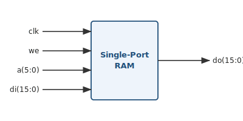

`read_a` registriert die Adresse bei der Taktflanke. Gelesen wird mit dieser registrierten Adresse, dadurch ist das Lesen **synchron** → der Synthesizer baut einen **Block-RAM (BRAM)** und es entsteht **1 Takt Latenz** (Adresse anlegen, einen Takt später das Datum auf `do`). Direkt mit `a` lesen wäre asynchron und ergäbe LUT-RAM statt BRAM.

```vhdl
LIBRARY ieee;
USE ieee.std_logic_1164.all;
USE ieee.numeric_std.all;

ENTITY sp_ram IS
    PORT (clk : IN  STD_LOGIC;
          we  : IN  STD_LOGIC;
          a   : IN  STD_LOGIC_VECTOR(5 DOWNTO 0);    -- Adresse (64 Wörter)
          di  : IN  STD_LOGIC_VECTOR(15 DOWNTO 0);   -- Dateneingang
          do  : OUT STD_LOGIC_VECTOR(15 DOWNTO 0));  -- Datenausgang
END sp_ram;

ARCHITECTURE syn OF sp_ram IS
    TYPE ram_type IS ARRAY (63 DOWNTO 0) OF STD_LOGIC_VECTOR(15 DOWNTO 0);
    SIGNAL RAM    : ram_type;
    SIGNAL read_a : STD_LOGIC_VECTOR(5 DOWNTO 0);
BEGIN
    PROCESS (clk)
    BEGIN
        IF clk'EVENT AND clk = '1' THEN
            IF we = '1' THEN
                RAM(to_integer(UNSIGNED(a))) <= di;   -- schreiben
            END IF;
            read_a <= a;                              -- Adresse registrieren
        END IF;
    END PROCESS;

    do <= RAM(to_integer(UNSIGNED(read_a)));          -- synchrones Lesen (1 Takt Latenz)
END ARCHITECTURE syn;
```

### Aufgabe 15.2 Dual-Port-RAM

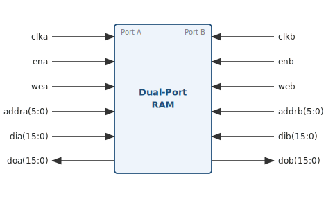

Zwei unabhängige Ports A und B mit eigenem Takt greifen auf denselben Speicher zu, deshalb `shared variable` statt `signal`. Jeder Port schreibt und liest synchron in seinem eigenen Prozess. So entsteht ein True-Dual-Port-BRAM, über den zwei Taktdomänen gleichzeitig auf den Speicher zugreifen können.

```vhdl
LIBRARY ieee;
USE ieee.std_logic_1164.all;
USE ieee.numeric_std.all;

ENTITY rams_16 IS
    PORT (clka, clkb   : IN  STD_LOGIC;
          ena,  enb    : IN  STD_LOGIC;
          wea,  web    : IN  STD_LOGIC;
          addra, addrb : IN  STD_LOGIC_VECTOR(5 DOWNTO 0);
          dia,  dib    : IN  STD_LOGIC_VECTOR(15 DOWNTO 0);
          doa,  dob    : OUT STD_LOGIC_VECTOR(15 DOWNTO 0));
END rams_16;

ARCHITECTURE syn OF rams_16 IS
    TYPE ram_type IS ARRAY (63 DOWNTO 0) OF STD_LOGIC_VECTOR(15 DOWNTO 0);
    SHARED VARIABLE RAM : ram_type;             -- von beiden Ports nutzbar
BEGIN
    PROCESS (clka)                              -- Port A
    BEGIN
        IF clka'EVENT AND clka = '1' THEN
            IF ena = '1' THEN
                IF wea = '1' THEN
                    RAM(to_integer(UNSIGNED(addra))) := dia;
                END IF;
                doa <= RAM(to_integer(UNSIGNED(addra)));
            END IF;
        END IF;
    END PROCESS;

    PROCESS (clkb)                              -- Port B
    BEGIN
        IF clkb'EVENT AND clkb = '1' THEN
            IF enb = '1' THEN
                IF web = '1' THEN
                    RAM(to_integer(UNSIGNED(addrb))) := dib;
                END IF;
                dob <= RAM(to_integer(UNSIGNED(addrb)));
            END IF;
        END IF;
    END PROCESS;
END ARCHITECTURE syn;
```

## Aufgabe 16: Zustandsautomat Modulo-4-Zähler (FSM)

Modulo-4-Zähler in Zwei-Prozess-Schreibweise. Bei `x = '1'` zählt der Automat einen Zustand weiter (S0 → S1 → S2 → S3 → S0), bei `x = '0'` hält er, `reset = '1'` setzt synchron auf S0.

### Aufgabe 16.1 Moore-Automat (synchroner Reset)

```vhdl
LIBRARY ieee;
USE ieee.std_logic_1164.ALL;

ENTITY counter IS
    PORT(x          : IN  STD_LOGIC;
         z          : OUT STD_LOGIC_VECTOR(1 DOWNTO 0);
         clk, reset : IN  STD_LOGIC);
END ENTITY counter;

ARCHITECTURE behavioral OF counter IS
    TYPE stateT IS (S0, S1, S2, S3);   -- automatische Bereichsprüfung
    SIGNAL state : stateT;
BEGIN
    -- 1. Zustandsübergang und Zustandsregister (synchroner Reset)
    PROCESS (clk) IS
    BEGIN
        IF RISING_EDGE(clk) THEN
            IF reset = '1' THEN
                state <= S0;
            ELSE
                CASE state IS
                    WHEN S0 => IF x = '1' THEN state <= S1; ELSE state <= S0; END IF;
                    WHEN S1 => IF x = '1' THEN state <= S2; ELSE state <= S1; END IF;
                    WHEN S2 => IF x = '1' THEN state <= S3; ELSE state <= S2; END IF;
                    WHEN S3 => IF x = '1' THEN state <= S0; ELSE state <= S3; END IF;
                END CASE;
            END IF;
        END IF;
    END PROCESS;

    -- 2. Ausgang, nur vom Zustand abhängig (Moore)
    PROCESS (state) IS
    BEGIN
        CASE state IS
            WHEN S0 => z <= "00";
            WHEN S1 => z <= "01";
            WHEN S2 => z <= "10";
            WHEN S3 => z <= "11";
        END CASE;
    END PROCESS;
END ARCHITECTURE behavioral;
```

### Aufgabe 16.2 Mealy-Automat (Ausgang)

Beim Mealy-Automat hängt der Ausgang zusätzlich vom Eingang ab, deshalb steht der Eingang in der Sensitivity-List und `z` wird im selben `CASE` aus Zustand und Eingang gebildet. Der Zustandsübergang bleibt wie in 16.1. Im Skript-Beispiel ist `z` drei Bit breit und der Eingang heißt `input`.

```vhdl
-- nur der Ausgangsprozess, z hängt von Zustand und Eingang ab
PROCESS (state, input) IS
BEGIN
    CASE state IS
        WHEN S0 => IF input = '1' THEN z <= "100"; ELSE z <= "000"; END IF;
        WHEN S1 => IF input = '1' THEN z <= "101"; ELSE z <= "001"; END IF;
        WHEN S2 => IF input = '1' THEN z <= "110"; ELSE z <= "010"; END IF;
        WHEN S3 => IF input = '1' THEN z <= "111"; ELSE z <= "011"; END IF;
    END CASE;
END PROCESS;
```

## Aufgabe 17: Optimierung (Mittelwert aus 4 Werten)

Derselbe Mittelwert aus vier Eingangswerten, einmal iterativ (wenig Fläche, ein Addierer, vier Takte) und einmal als Pipeline (hoher Durchsatz, ein Ergebnis pro Takt). Vergleiche dazu die Übersicht in Kapitel 14.7 des Cheat Sheets.

### Aufgabe 17.1 Iterativ (wenig Fläche)

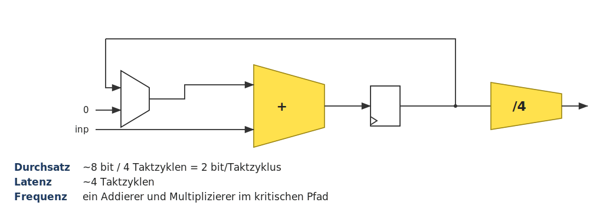

```vhdl
LIBRARY ieee;
USE ieee.std_logic_1164.all;
USE ieee.numeric_std.all;

ENTITY iterativeavg IS
    GENERIC(nbits : NATURAL := 8);
    PORT ( avg      : OUT STD_ULOGIC_VECTOR(nbits-1 DOWNTO 0);
           finished : OUT STD_ULOGIC;
           inp      : IN  STD_ULOGIC_VECTOR(nbits-1 DOWNTO 0);
           clk      : IN  STD_ULOGIC;
           start    : IN  STD_ULOGIC);
END ENTITY iterativeavg;

ARCHITECTURE behavioral OF iterativeavg IS
    SIGNAL ncount : UNSIGNED(nbits-1 DOWNTO 0);
    SIGNAL sum    : UNSIGNED(nbits+1 DOWNTO 0);
    SIGNAL div    : UNSIGNED(nbits+1 DOWNTO 0);
    SIGNAL t_fin  : STD_ULOGIC;
BEGIN
    t_fin <= '1' WHEN ncount = 0 ELSE '0';

    PROCESS (clk) IS
    BEGIN
        IF RISING_EDGE(clk) THEN
            IF start = '1' THEN
                sum    <= "00" & UNSIGNED(inp);      -- mit erstem Wert starten
                ncount <= to_unsigned(3, nbits);     -- noch 3 Additionen
            ELSIF t_fin = '0' THEN
                ncount <= ncount - 1;
                sum    <= sum + ("00" & UNSIGNED(inp));
            END IF;
        END IF;
    END PROCESS;

    finished <= t_fin;
    div <= sum / 4;                                  -- zwei Mal rechts schieben
    avg <= STD_ULOGIC_VECTOR(div(nbits-1 DOWNTO 0));
END ARCHITECTURE behavioral;
```

### Aufgabe 17.2 Pipeline (hoher Durchsatz)

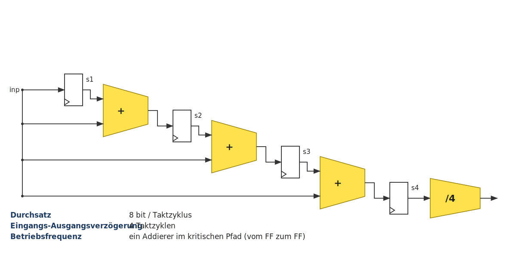

```vhdl
LIBRARY ieee;
USE ieee.std_logic_1164.all;
USE ieee.numeric_std.all;

ENTITY pipeavg IS
    GENERIC(nbits : NATURAL := 8);
    PORT ( avg : OUT STD_ULOGIC_VECTOR(nbits-1 DOWNTO 0);
           inp : IN  STD_ULOGIC_VECTOR(nbits-1 DOWNTO 0);
           clk : IN  STD_ULOGIC);
END ENTITY pipeavg;

ARCHITECTURE behavioral OF pipeavg IS
    SIGNAL div            : UNSIGNED(nbits+1 DOWNTO 0);
    SIGNAL s1, s2, s3, s4 : UNSIGNED(nbits+1 DOWNTO 0);
BEGIN
    PROCESS (clk) IS
    BEGIN
        IF RISING_EDGE(clk) THEN
            s1 <= ("00" & UNSIGNED(inp));            -- Pipeline-Stufe 1
            s2 <= s1 + ("00" & UNSIGNED(inp));       -- Pipeline-Stufe 2
            s3 <= s2 + ("00" & UNSIGNED(inp));       -- Pipeline-Stufe 3
            s4 <= s3 + ("00" & UNSIGNED(inp));       -- Pipeline-Stufe 4
        END IF;
    END PROCESS;

    div <= s4 / 4;
    avg <= STD_ULOGIC_VECTOR(div(nbits-1 DOWNTO 0));
END ARCHITECTURE behavioral;
```

### Aufgabe 17.3 Geringe Latenz

Wie die Pipeline, aber das letzte Register entfällt und das ÷4 liegt mit im Takt des letzten Addierers. Dadurch sinkt die Latenz von vier auf drei Takte, im kritischen Pfad liegen jetzt ein Addierer und der ÷4-Dividierer. Eigener VHDL-Code steht im Skript nicht, es ist die Pipeline aus 17.2 mit einem Register weniger.

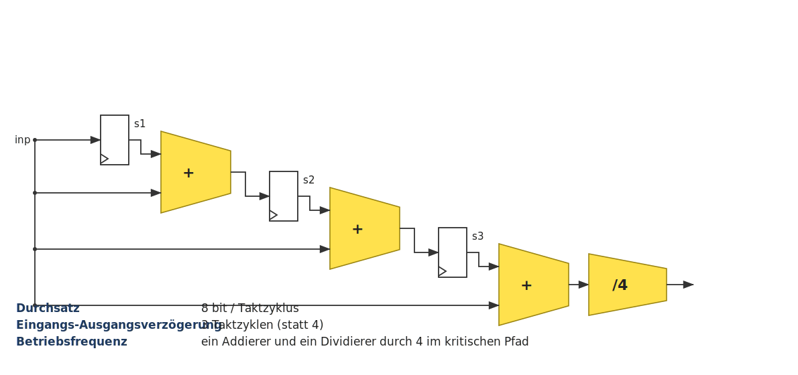

### Aufgabe 17.4 FIR-Filter mit langem kritischen Pfad

Gewichteter Durchschnitt aus vier aufeinanderfolgenden Werten, also `inp` und die verzögerten `s1`, `s2`, `s3`, multipliziert mit den Koeffizienten `a`, `b`, `c`, `d`. Im kritischen Pfad liegen ein Multiplizierer und drei Addierer hintereinander, das begrenzt die Frequenz.

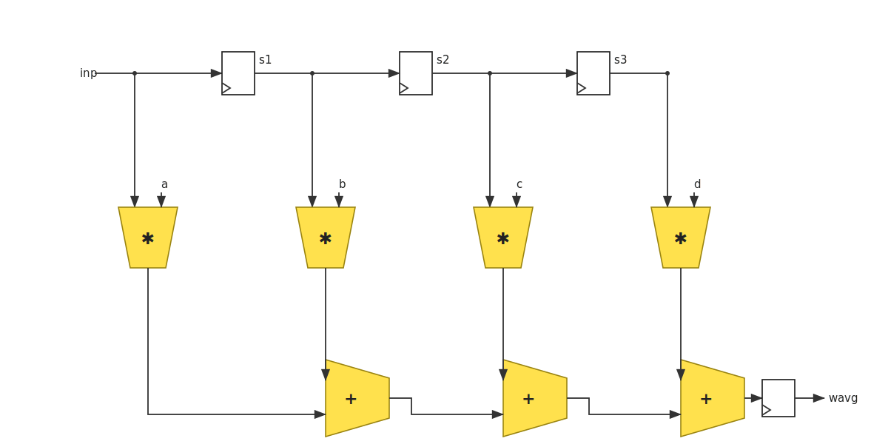

```vhdl
LIBRARY ieee;
USE ieee.std_logic_1164.all;
USE ieee.numeric_std.all;

ENTITY fir IS
    GENERIC(nbits : NATURAL := 8);
    PORT ( wavg            : OUT STD_ULOGIC_VECTOR((2*nbits)-1 DOWNTO 0);
           inp, a, b, c, d : IN  STD_ULOGIC_VECTOR(nbits-1 DOWNTO 0);
           clk, valid      : IN  STD_ULOGIC);
END ENTITY fir;

ARCHITECTURE rtl OF fir IS
    SIGNAL s1, s2, s3 : STD_ULOGIC_VECTOR(nbits-1 DOWNTO 0);
BEGIN
    PROCESS (clk) IS
    BEGIN
        IF RISING_EDGE(clk) THEN
            IF valid = '1' THEN
                s1 <= inp;                       -- Schieberegister
                s2 <= s1;
                s3 <= s2;
                wavg <= STD_ULOGIC_VECTOR(        -- Multiplizierer und Addierer im selben Takt
                            UNSIGNED(inp) * UNSIGNED(a) +
                            UNSIGNED(s1)  * UNSIGNED(b) +
                            UNSIGNED(s2)  * UNSIGNED(c) +
                            UNSIGNED(s3)  * UNSIGNED(d));
            END IF;
        END IF;
    END PROCESS;
END ARCHITECTURE rtl;
```

### Aufgabe 17.5 FIR-Filter mit eingefügten Registern

Nach jedem Multiplizierer kommt ein Register (`p1` bis `p4`). Multiplikation und Addiererkette liegen jetzt in getrennten Takten, der kritische Pfad wird kürzer und die Betriebsfrequenz steigt, dafür kostet es etwas mehr Fläche und einen Takt mehr Latenz.

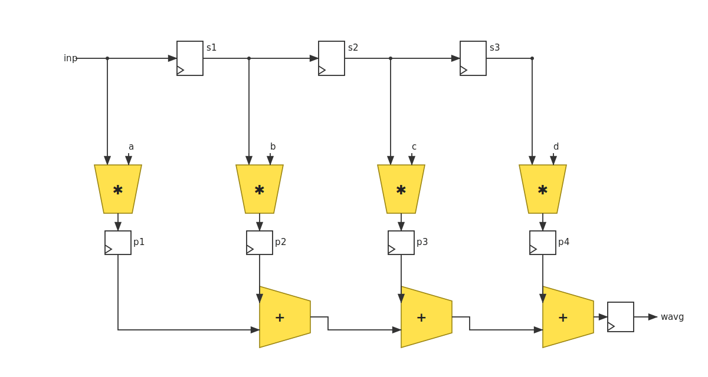

```vhdl
ARCHITECTURE rtl OF firreg IS
    SIGNAL s1, s2, s3     : STD_ULOGIC_VECTOR(nbits-1 DOWNTO 0);
    SIGNAL p1, p2, p3, p4 : UNSIGNED((2*nbits)-1 DOWNTO 0);
BEGIN
    PROCESS (clk) IS
    BEGIN
        IF RISING_EDGE(clk) THEN
            IF valid = '1' THEN
                s1 <= inp;
                s2 <= s1;
                s3 <= s2;
                p1 <= UNSIGNED(inp) * UNSIGNED(a);   -- Produkte registern
                p2 <= UNSIGNED(s1)  * UNSIGNED(b);
                p3 <= UNSIGNED(s2)  * UNSIGNED(c);
                p4 <= UNSIGNED(s3)  * UNSIGNED(d);
                wavg <= STD_ULOGIC_VECTOR(p1 + p2 + p3 + p4);
            END IF;
        END IF;
    END PROCESS;
END ARCHITECTURE rtl;
```

### Aufgabe 17.6 Parallelismus (8×8-Multiplizierer)

Ein 8×8-Bit-Multiplizierer lässt sich durch mehrere kleinere 4×4-Multiplizierer ersetzen, die parallel arbeiten. Man teilt den 8-Bit-Wert in zwei 4-Bit-Hälften, `X = A·2⁴ + B`.

`X·X = (A·2⁴ + B)² = A·A·2⁸ + 2·A·B·2⁴ + B·B = A·A·2⁸ + A·B·2⁵ + B·B`

`A·A`, `A·B` und `B·B` sind je eine einfache 4×4-Multiplikation, die Faktoren `2⁸` und `2⁵` sind reine Schiebeoperationen. So wird aus einem großen Multiplizierer eine Handvoll kleiner, paralleler.

### Aufgabe 17.7 Vereinfachen logischer Strukturen (Prioritätsencoder)

Erste Version als Prioritätsencoder mit `ELSIF`. Durch die `IF/ELSIF`-Kette hat `ctrl(0)` die höchste Priorität, weil es zuerst geprüft wird.

```vhdl
ENTITY priorityenc IS
    PORT ( clk, inp : IN  STD_ULOGIC;
           ctrl     : IN  STD_ULOGIC_VECTOR(3 DOWNTO 0);
           rout     : OUT STD_ULOGIC_VECTOR(3 DOWNTO 0));
END priorityenc;

ARCHITECTURE rtl OF priorityenc IS
BEGIN
    PROCESS (clk)
    BEGIN
        IF RISING_EDGE(clk) THEN
            IF    ctrl(0) = '1' THEN  rout(0) <= inp;
            ELSIF ctrl(1) = '1' THEN  rout(1) <= inp;
            ELSIF ctrl(2) = '1' THEN  rout(2) <= inp;
            ELSIF ctrl(3) = '1' THEN  rout(3) <= inp;
            END IF;
        END IF;
    END PROCESS;
END ARCHITECTURE rtl;
```

In der Synthese entsteht daraus eine Prioritätslogik. Jeder Ausgang braucht ein UND-Gatter, das sein `ctrl`-Bit mit den negierten Bits höherer Priorität verknüpft (`AND2B1`, `AND3B2`, `AND4B3`), und über die Enable-Logik ein Register ansteuert.

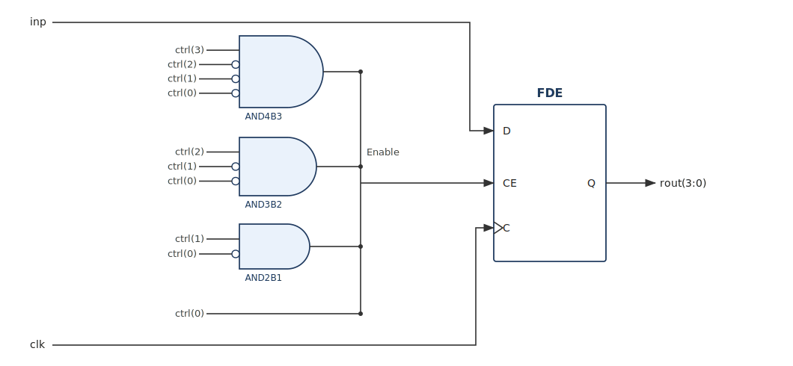

Wenn sich die Eingangssignale gegenseitig ausschließen, wenn also immer nur ein `ctrl`-Bit `'1'` ist, braucht man keine Priorität. Dann reichen vier getrennte `IF`-Abfragen.

```vhdl
PROCESS (clk)
BEGIN
    IF RISING_EDGE(clk) THEN
        IF ctrl(0) = '1' THEN rout(0) <= inp; END IF;
        IF ctrl(1) = '1' THEN rout(1) <= inp; END IF;
        IF ctrl(2) = '1' THEN rout(2) <= inp; END IF;
        IF ctrl(3) = '1' THEN rout(3) <= inp; END IF;
    END IF;
END PROCESS;
```

Das Ergebnis ist viel kleiner. Es bleibt nur ein Register, dessen Enable direkt am `ctrl`-Bus hängt, die Prioritäts-UND-Gatter entfallen komplett.

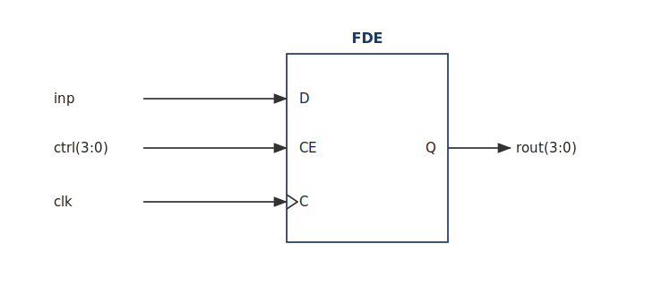

Dein Kommentar dazu

* keine Priorität nötig
* es kann nur `"0001"` und nicht `"0011"` auftreten
* die doppelte Abfrage (die negierten Bits) entfällt, die Logik wird kleiner

### Aufgabe 17.8 Balancierung des kritischen Pfads

Vier Werte aufaddieren. Schreibt man `sum <= s1 + s2 + s3 + s4` in einer Zeile, entsteht eine Kette aus drei Addierern hintereinander, der kritische Pfad ist lang. Baut man stattdessen einen Baum (`s1 = inp1 + inp2`, `s2 = inp3 + inp4`, `sum = s1 + s2`), liegt pro Taktstufe nur ein Addierer, der Pfad wird kürzer und die Frequenz steigt, bei gleicher Latenz.

**Unbalanciert, lange Kette (kritischer Pfad = 3 Addierer)**

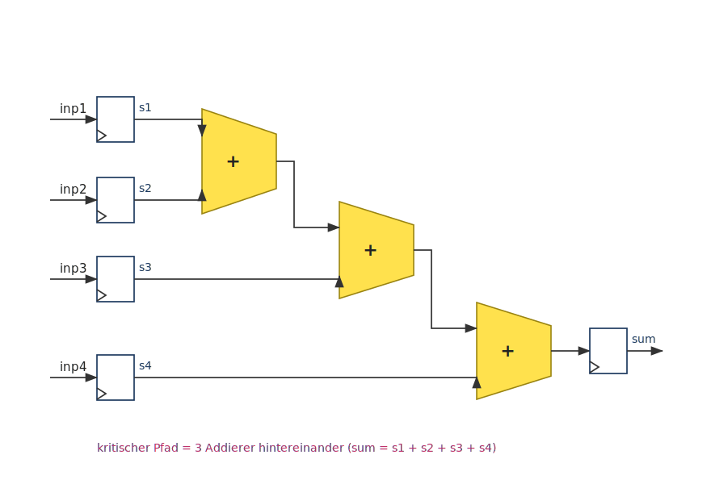

```vhdl
ENTITY adder IS
    GENERIC(nbits : NATURAL := 8);
    PORT ( sum                    : OUT STD_ULOGIC_VECTOR(nbits+1 DOWNTO 0);
           inp1, inp2, inp3, inp4 : IN  STD_ULOGIC_VECTOR(nbits-1 DOWNTO 0);
           clk                    : IN  STD_ULOGIC);
END ENTITY adder;

ARCHITECTURE rtl OF adder IS
    SIGNAL s1, s2, s3, s4 : UNSIGNED(nbits+1 DOWNTO 0);
BEGIN
    PROCESS (clk) IS
    BEGIN
        IF RISING_EDGE(clk) THEN
            s1 <= ("00" & UNSIGNED(inp1));
            s2 <= ("00" & UNSIGNED(inp2));
            s3 <= ("00" & UNSIGNED(inp3));
            s4 <= ("00" & UNSIGNED(inp4));
            sum <= STD_ULOGIC_VECTOR(s1 + s2 + s3 + s4);   -- drei Addierer in Reihe
        END IF;
    END PROCESS;
END ARCHITECTURE rtl;
```

**Balanciert, Baum (kritischer Pfad = 1 Addierer pro Stufe)**

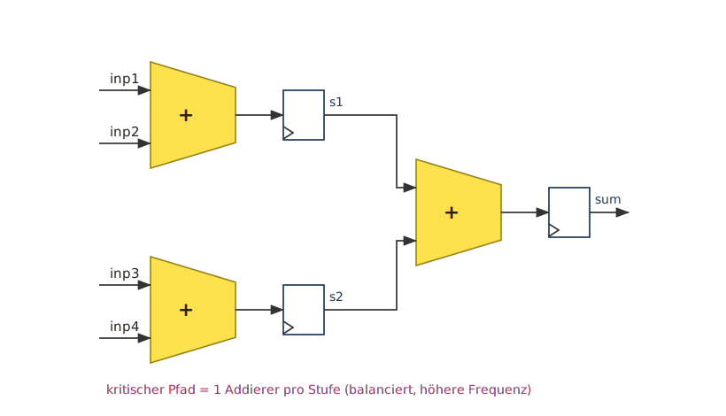

Gleiche Ports wie oben, nur die Architecture ändert sich. Die Summe wird paarweise gebildet, jede Teilsumme bekommt ihr eigenes Register.

```vhdl
ARCHITECTURE rtl OF adderbalanced IS
    SIGNAL s1, s2 : UNSIGNED(nbits+1 DOWNTO 0);
BEGIN
    PROCESS (clk) IS
    BEGIN
        IF RISING_EDGE(clk) THEN
            s1  <= ("00" & UNSIGNED(inp1)) + ("00" & UNSIGNED(inp2));
            s2  <= ("00" & UNSIGNED(inp3)) + ("00" & UNSIGNED(inp4));
            sum <= STD_ULOGIC_VECTOR(s1 + s2);             -- ein Addierer pro Stufe
        END IF;
    END PROCESS;
END ARCHITECTURE rtl;
```

### Aufgabe 17.9 Unrolling the Pipeline (serieller Multiplizierer)

Das ist das Gegenstück zu Balancierung und Parallelisierung. Statt eines großen Multiplizierers, der in einem Takt fertig ist, baut man einen seriellen Schiebe-Addier-Multiplizierer. Der braucht nur ein Schieberegister pro Operand, einen Addierer und einen Zähler, also viel weniger Fläche, dafür mehrere Takte pro Multiplikation. Der Durchsatz sinkt und eine Steuerlogik kommt dazu.

Der große Multiplizierer in einem Takt sieht so aus.

```vhdl
ENTITY mult IS
    GENERIC(nbits : NATURAL := 8);
    PORT ( prod       : OUT STD_ULOGIC_VECTOR((2*nbits)-1 DOWNTO 0);
           inp1, inp2 : IN  STD_ULOGIC_VECTOR(nbits-1 DOWNTO 0);
           clk        : IN  STD_ULOGIC);
END ENTITY mult;

ARCHITECTURE rtl OF mult IS
BEGIN
    PROCESS (clk) IS
    BEGIN
        IF RISING_EDGE(clk) THEN
            prod <= STD_ULOGIC_VECTOR(UNSIGNED(inp1) * UNSIGNED(inp2));
        END IF;
    END PROCESS;
END ARCHITECTURE rtl;
```

Seriell, mit Schieben und Addieren über mehrere Takte.

```vhdl
ENTITY multser IS
    GENERIC(nbits : NATURAL := 8);
    PORT ( prod       : OUT STD_ULOGIC_VECTOR((2*nbits)-1 DOWNTO 0);
           done       : OUT STD_ULOGIC;
           inp1, inp2 : IN  STD_ULOGIC_VECTOR(nbits-1 DOWNTO 0);
           clk, start : IN  STD_ULOGIC);
END ENTITY multser;

ARCHITECTURE rtl OF multser IS
    SIGNAL shift1        : STD_ULOGIC_VECTOR((2*nbits)-1 DOWNTO 0);
    SIGNAL shift2        : STD_ULOGIC_VECTOR(nbits-1 DOWNTO 0);
    SIGNAL adden, t_done : STD_ULOGIC;
    SIGNAL multcounter   : UNSIGNED(4 DOWNTO 0);
    SIGNAL t_prod        : UNSIGNED((2*nbits)-1 DOWNTO 0);
BEGIN
    PROCESS (clk) IS
    BEGIN
        IF RISING_EDGE(clk) THEN
            -- Zähler hochzählen
            IF start = '1' THEN
                multcounter <= (OTHERS => '0');
            ELSIF t_done /= '1' THEN
                multcounter <= multcounter + 1;
            END IF;
            -- Schieberegister 2 (Multiplikator, nach links)
            IF start = '1' THEN
                shift2 <= inp2;
            ELSE
                shift2 <= STD_ULOGIC_VECTOR(UNSIGNED(shift2) SLL 1);
            END IF;
            -- Schieberegister 1 (Multiplikand, nach rechts)
            IF start = '1' THEN
                shift1 <= '0' & inp1 & "0000000";
            ELSE
                shift1 <= STD_ULOGIC_VECTOR(UNSIGNED(shift1) SRL 1);
            END IF;
            -- Teilprodukt aufaddieren
            IF start = '1' THEN
                t_prod <= (OTHERS => '0');
            ELSIF adden = '1' THEN
                t_prod <= t_prod + UNSIGNED(shift1);
            END IF;
        END IF;
    END PROCESS;

    adden  <= shift2(nbits-1) AND (NOT t_done);
    t_done <= multcounter(3);
    done   <= t_done;
    prod   <= STD_ULOGIC_VECTOR(t_prod);
END ARCHITECTURE rtl;
```

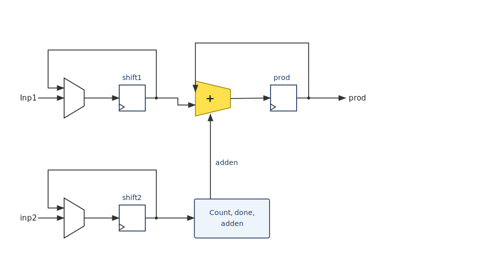

### Aufgabe 17.10 Resource Sharing

Brauchen zwei Teile der Schaltung nie gleichzeitig denselben Baustein, zum Beispiel einen Zähler oder einen Komparator, kann man diesen Baustein gemeinsam nutzen. Aus zwei Zählern wird einer, das spart Fläche. Dafür braucht man eine Steuerlogik, die den gemeinsamen Baustein umschaltet, und der Durchsatz kann sinken.

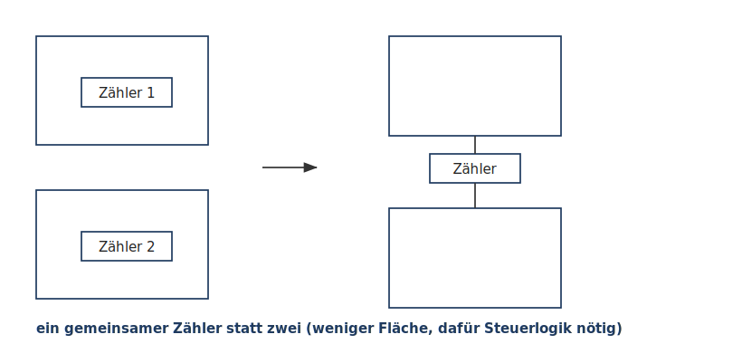

### Aufgabe 17.11 Einfluss von Reset (SRL16)

Ein Schieberegister einmal mit synchronem Reset und einmal ohne, sonst gleich. Der Reset entscheidet, wie der Synthesizer es umsetzt, und das ist herstellerabhängig.

Mit Reset.

```vhdl
ENTITY shift_reg IS
    GENERIC(n : NATURAL := 16);
    PORT ( clk, cin, rst : IN  STD_ULOGIC;
           cout          : OUT STD_ULOGIC);
END shift_reg;

ARCHITECTURE synth OF shift_reg IS
    SIGNAL tmp : STD_ULOGIC_VECTOR(n-1 DOWNTO 0);
BEGIN
    PROCESS (clk)
    BEGIN
        IF RISING_EDGE(clk) THEN
            IF rst = '0' THEN
                tmp <= (OTHERS => '0');
            ELSE
                tmp <= tmp(n-2 DOWNTO 0) & cin;
            END IF;
        END IF;
    END PROCESS;
    cout <= tmp(n-1);
END ARCHITECTURE synth;
```

Ohne Reset, gleiche Entity, nur der Prozess ohne die Reset-Abfrage.

```vhdl
ARCHITECTURE synth OF shift_reg IS
    SIGNAL tmp : STD_ULOGIC_VECTOR(n-1 DOWNTO 0);
BEGIN
    PROCESS (clk)
    BEGIN
        IF RISING_EDGE(clk) THEN
            tmp <= tmp(n-2 DOWNTO 0) & cin;
        END IF;
    END PROCESS;
    cout <= tmp(n-1);
END ARCHITECTURE synth;
```

Der Unterschied liegt daran, ob es für die Schaltung ein fertiges, dediziertes Primitive (ein eigenes Modell) gibt. Ohne Reset existiert eines, der `SRL16`, also ein ganzes Schieberegister in einer einzigen LUT. Das nimmt der Synthesizer und spart viel Fläche. Mit Reset gibt es kein solches Modell, der `SRL16` lässt sich nicht zurücksetzen, deshalb baut der Synthesizer das Register aus n einzelnen Flip-Flops (`FDR`).

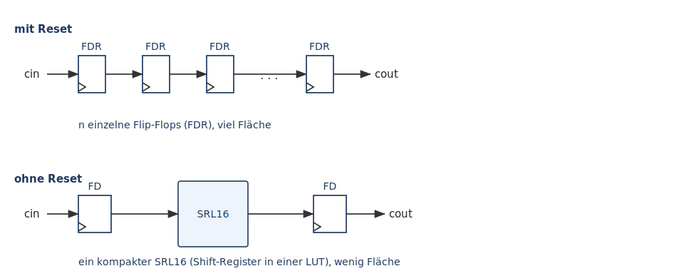


## Aufgabe 18: PSL-Assertions (PRÜFUNG)

Die Beispiele zu [Kapitel 16.2 PSL-Assertions](VHDL%20Cheat%20Sheet.md#162-psl-assertions) aus dem Cheat Sheet.

### Aufgabe 18.1 Zähler mit drei Assertions (PRÜFUNG)

Der Zähler zählt je nach `ctrl` hoch, runter, lädt einen Wert oder hält ihn. `max` ist der erlaubte Höchstwert, `ofl` der Überlaufwert (alle Bits `'1'`) und `ufl` der Unterlaufwert (alle Bits `'0'`). Der Reset ist active-low.

```vhdl
LIBRARY ieee;
USE ieee.std_logic_1164.all;
USE ieee.numeric_std.all;

ENTITY counter IS
  GENERIC (n : NATURAL := 2);
  PORT (reset : IN  STD_ULOGIC;
        clk   : IN  STD_ULOGIC;
        ctrl  : IN  STD_ULOGIC_VECTOR(1 DOWNTO 0);
        load  : IN  UNSIGNED(n DOWNTO 0);
        count : OUT UNSIGNED(n DOWNTO 0));
END counter;

ARCHITECTURE rtl OF counter IS
  SIGNAL   tmp : UNSIGNED(n DOWNTO 0) := (others => '0');
  CONSTANT max : UNSIGNED(n DOWNTO 0) := (n => '1', others => '0');
  CONSTANT ofl : UNSIGNED(n DOWNTO 0) := (others => '1');
  CONSTANT ufl : UNSIGNED(n DOWNTO 0) := (others => '0');
BEGIN
  PROCESS (clk) BEGIN
    IF rising_edge(clk) THEN
      IF reset = '0' THEN
        tmp <= (others => '0');
      ELSE
        CASE ctrl IS
          WHEN "00"   => tmp <= load;
          WHEN "01"   => tmp <= tmp + 1;
          WHEN "10"   => tmp <= tmp - 1;
          WHEN others => tmp <= tmp;
        END CASE;
      END IF;
    END IF;
  END PROCESS;
  count <= tmp;

  -- psl default clock is RISING_EDGE(clk);
  -- psl exceed_max: assert always (NOT (count > max)) abort NOT(reset);
  -- psl overflow:   assert always (NOT((count = ofl) AND ctrl = "01")) abort NOT(reset);
  -- psl underflow:  assert always (NOT((count = ufl) AND ctrl = "10")) abort NOT(reset);
END rtl;
```

* `exceed_max` der Zählerstand darf `max` nie überschreiten.
* `overflow` beim Hochzählen (`ctrl = "01"`) darf der Zähler nicht vom Überlaufwert `ofl` (alle Bits `'1'`) auf `0` überlaufen.
* `underflow` beim Runterzählen (`ctrl = "10"`) darf der Zähler nicht von `0` (`ufl`) auf den Höchstwert unterlaufen.

Alle drei werden über `abort NOT(reset)` während des Resets nicht geprüft.

### Aufgabe 18.2 I2C-Start und fehlendes Acknowledge (PRÜFUNG)

Beim I2C-Bus beginnt eine Übertragung mit einer Start-Bedingung, danach folgen acht Bit und im neunten Takt das Acknowledge mit `sda = '0'`. Ein Prozess erkennt den Start, eine PSL-Assertion prüft das Acknowledge.

```vhdl
SIGNAL start : BOOLEAN;

PROCESS (scl, sda) BEGIN
  IF (sda'event AND sda = '0' AND scl = 'H') THEN
    start <= true;
  ELSIF rising_edge(scl) THEN
    start <= false;
  END IF;
END PROCESS;

-- psl property p_ack is always (start -> next[8] (sda = '0')) @rising_edge(scl);
-- psl missing_ack: assert p_ack;
```

`next[8]` zielt auf genau acht Takte nach dem Start, dort muss `sda = '0'` sein, sonst fehlt das Acknowledge. Gleichwertig mit einer Sequenz.

```vhdl
-- psl property p_ack1 is always ({start; [*8]} |-> (sda = '0')) @rising_edge(scl);
```