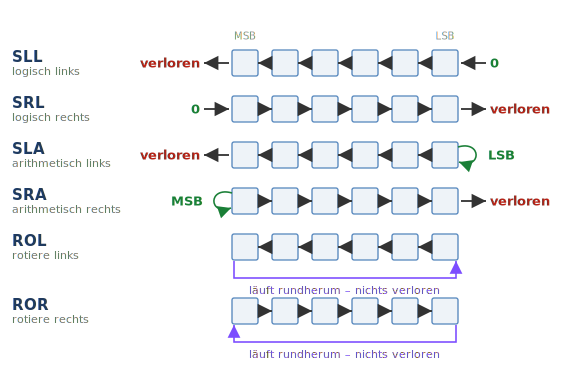
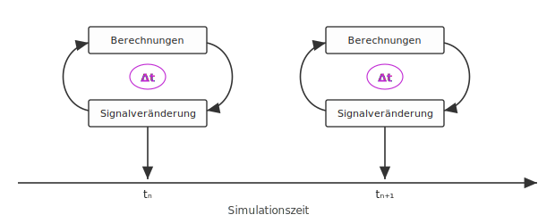
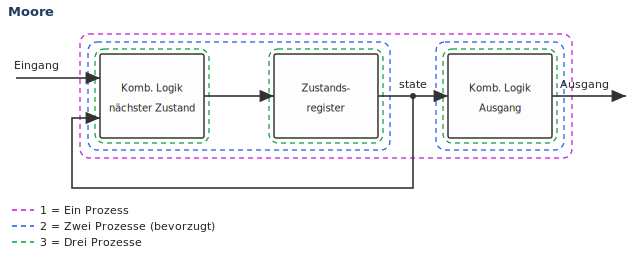
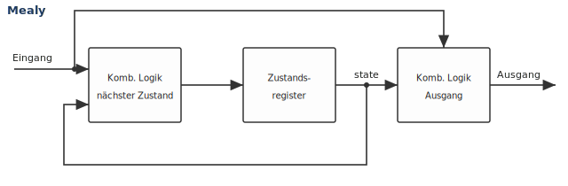

# VHDL Cheat Sheet

## 0. Inhaltsverzeichnis

1. [Datentypen](#1-datentypen)
    1. [Kategorien von Datentypen](#11-kategorien-von-datentypen)
    2. [Aufzählungstypen](#12-aufzählungstypen)
    3. [Numerische Typen](#13-numerische-typen)
        1. [Integer- und Real-Typen](#131-integer--und-real-typen)
        2. [Physikalische Typen](#132-physikalische-typen)
    4. [Arrays](#14-arrays)
    5. [Records](#15-records)
2. [STD_LOGIC – Logikwerte](#2-std_logic--logikwerte)
    1. [Bus-Resolution-Funktionen](#21-bus-resolution-funktionen)
3. [NUMERIC_STD – Arithmetik](#3-numeric_std--arithmetik)
4. [Typkonvertierung](#4-typkonvertierung)
    1. [Casts](#41-casts)
    2. [Konvertierungsfunktionen](#42-konvertierungsfunktionen)
5. [Operatoren](#5-operatoren)
    1. [Relationale Operatoren](#51-relationale-operatoren)
    2. [Logische Operatoren](#52-logische-operatoren)
    3. [Shift-Operatoren](#53-shift-operatoren)
6. [Attribute](#6-attribute)
    1. [Signal-Attribute](#61-signal-attribute)
    2. [Array-Attribute](#62-array-attribute)
    3. [Typ-Attribute](#63-typ-attribute)
7. [Entity – Schnittstelle](#7-entity--schnittstelle)
8. [Architecture – Implementierung](#8-architecture--implementierung)
    1. [Signalzuweisung](#81-signalzuweisung)
        1. [Bedingt (WHEN ELSE)](#811-bedingt-when-else)
        2. [Selektiv (WITH SELECT)](#812-selektiv-with-select)
    2. [Komponenten-Instanziierung](#82-komponenten-instanziierung)
    3. [Direkte Instanziierung](#83-direkte-instanziierung)
    4. [GENERATE (Strukturen replizieren)](#84-generate-strukturen-replizieren)
9. [Process – sequentieller Ablauf](#9-process--sequentieller-ablauf)
    1. [Wait-Anweisungen](#91-wait-anweisungen)
    2. [Sequentielle Anweisungen](#92-sequentielle-anweisungen)
10. [Unterprogramme (Funktionen & Prozeduren)](#10-unterprogramme-funktionen--prozeduren)
    1. [Funktionen](#101-funktionen)
    2. [Prozeduren](#102-prozeduren)
    3. [Übergabemechanismen (By Value / By Reference)](#103-übergabemechanismen-by-value--by-reference)
11. [Libraries & Packages](#11-libraries--packages)
    1. [Verwenden von Bibliotheken und Packages](#111-verwenden-von-bibliotheken-und-packages)
    2. [Standardbibliotheken](#112-standardbibliotheken)
    3. [Definieren von Bibliotheken und Packages](#113-definieren-von-bibliotheken-und-packages)
12. [Konfiguration](#12-konfiguration)
    1. [Entity-Konfiguration (Typ 1)](#121-entity-konfiguration-typ-1)
    2. [Instanz-Konfiguration (Typ 2)](#122-instanz-konfiguration-typ-2)
    3. [Beispiel: Entity-/Architecture-Wahl](#123-beispiel-entity-architecture-wahl)
    4. [Beispiel: Porttyp-Konvertierung](#124-beispiel-porttyp-konvertierung)
    5. [Verteilung auf Dateien](#125-verteilung-auf-dateien)
13. [Sichtbarkeit (Geltungsbereiche)](#13-sichtbarkeit-geltungsbereiche)
14. [Synthese](#14-synthese)
    1. [Synthetisierbare Datentypen](#141-synthetisierbare-datentypen)
    2. [Synthetisierbare Operatoren](#142-synthetisierbare-operatoren)
    3. [Nicht erlaubte Anweisungen](#143-nicht-erlaubte-anweisungen)
    4. [Kombinatorische Logik](#144-kombinatorische-logik)
    5. [Initialisierung und Reset](#145-initialisierung-und-reset)
15. [Testbenches (nur Simulation)](#15-testbenches-nur-simulation)
    1. [Testbench-Struktur](#151-testbench-struktur)
    2. [TEXTIO-Package](#152-textio-package)
16. [Assertions (nur Simulation)](#16-assertions-nur-simulation)
17. [Verzögerungsmodelle (nur Simulation)](#17-verzögerungsmodelle-nur-simulation)
    1. [Transport-Verzögerung](#171-transport-verzögerung)
    2. [Inertiale Verzögerung](#172-inertiale-verzögerung)


## 1. Datentypen

* `CONSTANT` : fester Wert (in Architecture, Process, Function, Procedure oder Package)
* `SIGNAL`   : Kommunikation zwischen verschiedenen Teilen der Architecture verwendet (Deklaration in der Architecture)
* `VARIABLE` : lokales Speichern von Werten (nur im Process)
* `FILE`/ `Dateien`: lesen / schreiben von Daten

### 1.1. Kategorien von Datentypen

* Skalare Typen (Scalar Types)
    * Aufzählungstypen (Enumeration Types)
    * Numerische Typen
        * Integer-Typen
        * Real-Typen
        * Physikalische Typen
* Zusammengesetzte Typen (Composite Types)
    * Array-Typen
    * Record-Typen
* File-Typen

### 1.2. Aufzählungstypen

```vhdl
TYPE type_name IS (wert1, wert2, ...); -- "0", "1" geht aber auch "S1", "S2" oder "rot", "grün"
SUBTYPE subtype_name IS type_name RANGE wert1 TO wert2;
```
### 1.3. Numerische Typen

#### 1.3.1. Integer- und Real-Typen
`INTEGER` – Ganzzahl (Bereich: -2^31 bis 2^31-1)
    
```vhdl
-- Vordefinierte Subtypen
SUBTYPE NATURAL  IS INTEGER RANGE 0 TO INTEGER'HIGH;
SUBTYPE POSITIVE IS INTEGER RANGE 1 TO INTEGER'HIGH;

-- Eigener Subtyp von INTEGER (bleibt kompatibel):
SUBTYPE byte IS INTEGER RANGE -128 TO 127;    -- oder RANGE 0 TO 255

-- Eigener, NEUER Integer-Typ (eigenständig, nur per Konvertierung mischbar):
TYPE coord IS RANGE -100 TO 100;

```

`REAL` – Gleitkomma (Bereich: -2^63 bis 2^63-1)

```vhdl
SUBTYPE REAL IS INTEGER RANGE -2**63 TO 2**63-1;
```

#### 1.3.2. Physikalische Typen

```vhdl
-- TIME ist vordefiniert (in STD.STANDARD):
TYPE time IS RANGE von TO bis
UNITS
    fs;              -- Basiseinheit
    ps = 1000 fs;
    ns = 1000 ps;
    ...
END UNITS;

-- Eigener physikalischer Typ (Kapazität):
TYPE capacitance IS RANGE 0 TO 1E9
UNITS
    fF;              -- Basiseinheit (Femtofarad)
    pF = 1000 fF;    -- Pikofarad
    nF = 1000 pF;    -- Nanofarad
    uF = 1000 nF;    -- Mikrofarad (µF)
END UNITS capacitance;
```

### 1.4. Arrays

```vhdl
-- Array-Typen definieren 
TYPE fixed_range IS ARRAY (bereich) OF element_typ;            -- BESCHRÄNKT: feste Größe, z. B. (0 TO 7)
TYPE x_by_y      IS ARRAY (bereich1, bereich2) OF element_typ; -- mehrdimensional
TYPE variable    IS ARRAY (positive RANGE <>) OF element_typ;  -- UNBESCHRÄNKT: offene Größe (<>)

-- Array-Objekte deklarieren: bei UNBESCHRÄNKTEM Typ wird die Größe HIER festgelegt
VARIABLE array_name : variable(1 TO 10);     -- Index 1..10 (aufsteigend)
VARIABLE array_name : variable(10 DOWNTO 1); -- Index 10..1 (absteigend)
VARIABLE array_name : variable;              -- ❌ Fehler: unbeschränkt braucht einen Bereich!

-- Auf Elemente und Teilbereiche zugreifen 
signal_name(i)          -- einzelnes Element an Index i
signal_name(3)          -- Bit/Element an Position 3
signal_name(7 DOWNTO 4) -- Teilbereich (Slice), hier 4 Bits
signal_name(0 TO 3)     -- Slice in aufsteigender Richtung

-- Ganzen Vektor setzen (Aggregat) – OTHERS = alle übrigen Indizes
sig <= (OTHERS => '0');             -- alle Bits 0 (typischer Reset)
sig <= (OTHERS => '1');             -- alle Bits 1
sig <= (7 => '1', OTHERS => '0');   -- Bit 7 = '1', Rest = '0'
sig <= ('1', '0', OTHERS => '0');   -- Position 0 = '1', 1 = '0', Rest = '0'

TYPE led_matrix IS ARRAY (0 TO 3, 0 TO 3) OF BIT;   -- definiert einen neuen Typ namens led_matrix
SIGNAL display : led_matrix;                         -- erzeugt ein konkretes Objekt dieses Typs
```

### 1.5. Records
Vergleichbar mit einem struct in C: nur Datenfelder, keine Methoden/Vererbung

```vhdl
TYPE record_name IS RECORD
    feld1 : typ1;
    feld2 : typ2;
    ...
END RECORD;

VARIABLE record_name : record_name;

record_name.feld1 := wert;     -- Feldzugriff per Punkt
```


## 2. STD_LOGIC – Logikwerte

Das Package `IEEE.STD_LOGIC_1164` definiert die Datentypen `STD_ULOGIC` und `STD_ULOGIC_VECTOR`.
Sie werden verwendet, um digitale Signale mit zusätzlichen Zuständen darzustellen.

* `U` – uninitialisiert (uninitialized)
* `X` – unbekannt (unknown)
* `0` – logisch 0
* `1` – logisch 1
* `Z` – hochohmig (high impedance)
* `W` – schwach unbekannt (weak unknown)
* `L` – schwach logisch 0
* `H` – schwach logisch 1
* `-` – don't care

Der Compiler erzeugt Fehler, wenn ein Signal von mehreren Quellen mit widersprüchlichen Werten getrieben wird.

### 2.1. Bus-Resolution-Funktionen

Die Bus-Resolution-Funktionen werden verwendet, um mehrere Quellen aufzulösen, die ein Signal treiben.

Die Verwendung der Datentypen `STD_LOGIC` und `STD_LOGIC_VECTOR` führt die Bus-Resolution-Funktionen ein.

```text
Das Ergebnis ist der Wert, der im Schema am weitesten oben steht:
        U
        │  
        X
    ┌───┼───┐
    0   -   1
    └───┬───┘
        W
    ┌───┴───┐
    L       H
    └───┬───┘
        Z
```


## 3. NUMERIC_STD – Arithmetik

`IEEE.NUMERIC_STD` und `IEEE.NUMERIC_BIT` ermöglichen numerische Operationen auf Vektor-Typen.
Dafür sind die Datentypen `SIGNED` und `UNSIGNED` definiert.
`NUMERIC_STD` baut auf `STD_LOGIC_VECTOR` auf, `NUMERIC_BIT` auf `BIT_VECTOR`.

Ein `STD_LOGIC_VECTOR` selbst kann **nicht** rechnen (kein `+`, `-`, …) – er ist nur eine Bitfolge. Für Arithmetik geht man über `UNSIGNED` / `SIGNED`.

**Cast zwischen Vektor-Typen** (gleiche Bitbreite, nur Umdeutung der Bits):

| von → nach | Funktion |
|---|---|
| `STD_LOGIC_VECTOR` → `UNSIGNED` | `unsigned(slv)` |
| `STD_LOGIC_VECTOR` → `SIGNED` | `signed(slv)` |
| `UNSIGNED` / `SIGNED` → `STD_LOGIC_VECTOR` | `std_logic_vector(x)` |

**Umrechnung von/nach `INTEGER`** (Bitbreite n beim Erzeugen angeben):

| von → nach | Funktion |
|---|---|
| `UNSIGNED` / `SIGNED` → `INTEGER` | `to_integer(x)` |
| `INTEGER` → `UNSIGNED` (n Bit) | `to_unsigned(wert, n)` |
| `INTEGER` → `SIGNED` (n Bit) | `to_signed(wert, n)` |

`STD_LOGIC_VECTOR` hat **keine** direkte Integer-Umwandlung – immer erst nach `UNSIGNED`/`SIGNED` casten.

**Beispiel:**
```vhdl
LIBRARY ieee;
USE ieee.std_logic_1164.ALL;
USE ieee.numeric_std.ALL;
-- ... in der Architecture deklariert:
SIGNAL slv : STD_LOGIC_VECTOR(7 DOWNTO 0);
SIGNAL u   : UNSIGNED(7 DOWNTO 0);
SIGNAL s   : SIGNED(7 DOWNTO 0);
SIGNAL i   : INTEGER;

-- INTEGER -> Vektor (Breite 8 angeben!)
u   <= to_unsigned(5, 8);                    -- 5 als 8-Bit UNSIGNED
s   <= to_signed(-3, 8);                     -- -3 als 8-Bit SIGNED (Zweierkomplement)
slv <= std_logic_vector(to_unsigned(5, 8));  -- dasselbe als STD_LOGIC_VECTOR

-- Vektor -> INTEGER
i <= to_integer(unsigned(slv));              -- erst casten, dann to_integer

-- Rechnen
u   <= u + 1;                                -- direkt auf UNSIGNED
slv <= std_logic_vector(unsigned(slv) + 1);  -- auf STD_LOGIC_VECTOR via Cast
```


## 4. Typkonvertierung

Zwei Mechanismen: **Casts** wandeln zwischen *verwandten* Typen (gleicher Basistyp – nur umgedeutet bzw. gerundet), **Konvertierungsfunktionen** zwischen *verschiedenen Darstellungen*.

**Faustregel:** gleicher Basistyp → Cast `typ(wert)`; andere Darstellung → Funktion `to_xxx(...)`.

### 4.1. Casts

| von → nach | Cast |
|---|---|
| `REAL` → `INTEGER` | `INTEGER(r)` – rundet zur nächsten ganzen Zahl |
| `INTEGER` → `REAL` | `REAL(i)` |
| `STD_LOGIC_VECTOR` → `UNSIGNED` / `SIGNED` | `unsigned(slv)` / `signed(slv)` |
| `UNSIGNED` / `SIGNED` → `STD_LOGIC_VECTOR` | `std_logic_vector(x)` |

### 4.2. Konvertierungsfunktionen

Aus `ieee.numeric_std` (Zahlentyp ↔ `INTEGER`):

| von → nach | Funktion |
|---|---|
| `UNSIGNED` / `SIGNED` → `INTEGER` | `to_integer(x)` |
| `INTEGER` → `UNSIGNED` (n Bit) | `to_unsigned(i, n)` |
| `INTEGER` → `SIGNED` (n Bit) | `to_signed(i, n)` |

Aus `ieee.std_logic_1164` (`BIT` ↔ `STD_LOGIC`):

| von → nach | Funktion |
|---|---|
| `BIT` → `STD_LOGIC` | `to_stdulogic(b)` |
| `STD_LOGIC` → `BIT` | `to_bit(s)` |
| `BIT_VECTOR` → `STD_LOGIC_VECTOR` | `to_stdlogicvector(bv)` |
| `STD_LOGIC_VECTOR` → `BIT_VECTOR` | `to_bitvector(slv)` |

**Metawerte bei `to_integer`:** `'0'`/`'L'` → `0`, `'1'`/`'H'` → `1`. Alles andere (`'U'`, `'X'`, `'W'`, `'Z'`, `'-'`) ist keine gültige Zahl → Ergebnis **`0`** + Simulations-**Warnung** (`metavalue detected, returning 0`). Mit `to_01(v, '0')` kann man Metawerte vorab durch einen definierten Wert ersetzen.


## 5. Operatoren

### 5.1. Relationale Operatoren

`=`, `/=` (ungleich), `<`, `<=`, `>`, `>=`

### 5.2. Logische Operatoren

`AND`, `OR`, `NAND`, `NOR`, `XOR`, `XNOR`, `NOT` (definiert für die Typen BOOLEAN und BIT)

* `NOT` hat die höchste Priorität; alle anderen Operatoren werden von links nach rechts ausgewertet.
* daher am besten Klammern verwenden

### 5.3. Shift-Operatoren

Sechs Operatoren der Form `vektor OP anzahl`, z. B. `vektor SRL 2` (um 2 Stellen schieben). Die **Anzahl ist ein `INTEGER`** (darf negativ sein → dreht die Richtung um); kommt sie aus einem Vektor, erst mit `to_integer(...)` wandeln.



`SRA` zieht das Vorzeichenbit nach → entspricht **Division durch 2** im Zweierkomplement.

Gilt für `BIT_VECTOR` (ab VHDL-2008 auch `STD_LOGIC_VECTOR`). In `numeric_std` alternativ `shift_left` / `shift_right` / `rotate_left` / `rotate_right`.


## 6. Attribute

Attribute liefern Informationen über Signale, Arrays, Typen oder Werte. Welche Objekte zulässig sind, hängt von der Kategorie ab.

### 6.1. Signal-Attribute

**Nur für Signale** – sie beziehen sich auf die Simulations-Historie (Events/Transactions). Auf Variablen oder Konstanten angewendet gibt es einen Compile-Fehler.

* `signal'EVENT` – liefert TRUE, wenn sich das Signal im aktuellen Simulationszyklus geändert hat.
* `signal'ACTIVE` – liefert TRUE, wenn das Signal aktuell getrieben wird.
* `signal'STABLE(t)` – liefert TRUE, wenn für t Zeiteinheiten kein Event aufgetreten ist. (Event = Änderung des Signalwerts)
* `signal'QUIET(t)` – liefert TRUE, wenn für t Zeiteinheiten keine Transaction aufgetreten ist. (Transaction = Aktualisierung des Signalwerts)
* `signal'DELAYED(t)` – liefert den Wert des Signals, verzögert um t Zeiteinheiten.
* `signal'TRANSACTION` – BIT, das bei jeder Transaction des Signals kippt.
* `signal'LAST_EVENT` – liefert die Zeit seit dem letzten Event des Signals.
* `signal'LAST_ACTIVE` – liefert die Zeit seit der letzten Transaction des Signals.
* `signal'LAST_VALUE` – liefert den Wert des Signals vor dem letzten Event.

`RISING_EDGE(signal)` und `FALLING_EDGE(signal)` sind vom Package `IEEE.STD_LOGIC_1164` vordefinierte Attribute.
Sie liefern TRUE, wenn das Signal im aktuellen Simulationszyklus eine steigende bzw. fallende Flanke hat.

```VHDL
-- D-FlipFlop-Beispiel (LIBRARY ieee; USE ieee.std_logic_1164.ALL; nicht vergessen!)
PROCESS(reset, clk) IS
BEGIN
    IF reset = '0' THEN
        q <= '0';
    ELSIF clk = '1' AND clk'EVENT THEN   -- steigende Taktflanke
        q <= d;
    END IF;
END PROCESS;
```

### 6.2. Array-Attribute

Gelten für **alles, was ein (begrenztes) Array ist** – also auch für Variablen, Konstanten und Array-Typen, nicht nur für Signale. (`array` steht für ein beliebiges Array-Objekt oder einen Array-Typ.)

* `array'LENGTH` – liefert die Anzahl der Elemente.
* `array'RANGE` – liefert den Indexbereich. (z. B. `0 TO 7`) (für Schleifen verwendet)
* `array'REVERSE_RANGE` – liefert den umgekehrten Indexbereich. (z. B. `7 DOWNTO 0`) (für Schleifen verwendet)
* `array'LEFT` / `array'RIGHT` – linke / rechte Indexgrenze.
* `array'HIGH` / `array'LOW` – höchster / niedrigster Index.
* `array'ASCENDING` – TRUE, wenn der Indexbereich aufsteigend ist (`TO`).

Typische Array-Typen sind **Vektoren** wie `STD_LOGIC_VECTOR`, `BIT_VECTOR` oder `UNSIGNED`/`SIGNED` – die Attribute funktionieren also direkt darauf (egal ob Signal, Variable oder Konstante):

```vhdl
SIGNAL data : STD_LOGIC_VECTOR(7 DOWNTO 0);
-- data'LENGTH        =  8
-- data'LEFT          =  7          -- erster Index
-- data'RIGHT         =  0          -- letzter Index
-- data'HIGH          =  7          -- größter Index
-- data'LOW           =  0          -- kleinster Index
-- data'RANGE         =  7 DOWNTO 0
-- data'REVERSE_RANGE =  0 TO 7
-- data'ASCENDING     =  FALSE      -- weil DOWNTO (bei TO wäre es TRUE)

-- Damit kann man index-unabhängig über den ganzen Vektor laufen:
FOR i IN data'RANGE LOOP
    data(i) <= '0';
END LOOP;
```

### 6.3. Typ-Attribute

Anwendbar auf einen **Typ-/Subtyp-Namen**, unabhängig von Signal/Variable/Konstante.

* `type'VAL(n)` – liefert den Wert an Position n (z. B. bei Aufzählungstypen).
* `type'POS(w)` – liefert die Position des Werts w.
* `type'SUCC(w)` / `type'PRED(w)` – Nachfolger / Vorgänger von w.
* `type'IMAGE(w)` – liefert den Wert w als String.
* `type'VALUE(s)` – wandelt den String s zurück in einen Typwert.

## 7. Entity – Schnittstelle

Eine Entity ist ein Modul, das die Schnittstelle einer digitalen Schaltung beschreibt.

```vhdl
ENTITY entity_name IS
    GENERIC ( generic_name : type := standardwert; );
    PORT ( a, b : <port_richtung> <port_typ>;
              c : <port_richtung> <port_typ>);
END ENTITY entity_name; 
```

* Gültige Port-Richtungen: `IN`, `OUT`, `INOUT`, `BUFFER`
* Grundlegende gültige Port-Typen: `BOOLEAN`, `BIT`, `INTEGER`, `REAL`, `CHARACTER` oder `BIT_VECTOR (1 DOWNTO 0)`
* `GENERIC` wird verwendet, um Parameter an die Entity zu übergeben. Es ist optional.
* Ports werden zur Kommunikation mit der Außenwelt verwendet.


## 8. Architecture – Implementierung

Eine Architecture ist ein Modul, das das Verhalten einer digitalen Schaltung beschreibt.

```vhdl
ARCHITECTURE architecture_name OF entity_name IS
    SIGNAL signal_name : type;
BEGIN
    -- VHDL-Code hier
END ARCHITECTURE architecture_name;
```
* Interne Signale werden zur Kommunikation zwischen verschiedenen Teilen der Architecture verwendet.

### 8.1. Signalzuweisung

```vhdl
signal_name <= wert;
```
* `<=` ist der Signalzuweisungsoperator.
* Dies ist eine nebenläufige (concurrent) Anweisung und wird ausgeführt, sobald sich eines der Signale auf der rechten Seite ändert.
* Dies gilt auch für bedingte Signalzuweisungen.

#### 8.1.1. Bedingt (WHEN ELSE)

```vhdl
signal_name <= wert1 WHEN bedingung ELSE
               wert2 WHEN bedingung ELSE
                 ...
               anderer_wert;
```
* `WHEN` wird verwendet, um einem Signal abhängig von einer Bedingung einen Wert zuzuweisen.
* `ELSE` ist optional. Ist es nicht vorhanden, behält das Signal seinen vorherigen Wert.

#### 8.1.2. Selektiv (WITH SELECT)

```vhdl
WITH selektor SELECT
    signal_name <= wert1 WHEN sel_wert1,
                   wert2 WHEN sel_wert2,
                     ...
                   anderer_wert WHEN OTHERS;
```

* `SELECT` wird verwendet, um einem Signal abhängig vom Wert eines Selektors einen Wert zuzuweisen.
* `OTHERS` fängt alle übrigen Fälle ab. Es ist immer erforderlich.

### 8.2. Komponenten-Instanziierung

Eine Komponente wird verwendet, um einen „Sockel" zu instanziieren. Ein Sockel ist ein Platzhalter für eine Entity, die in einer Architecture verwendet wird.

```vhdl
ARCHITECTURE architecture_name OF entity_name IS
    -- am besten direkt die Entity kopieren, ENTITY in COMPONENT umbenennen
    COMPONENT component_name
        PORT (  a, b: <port_typ>;
                c   : <port_typ>);
    END COMPONENT component_name;
BEGIN
    instance_name : component_name PORT MAP (a, b, c);
END ARCHITECTURE architecture_name;
```

* `PORT MAP` wird verwendet, um die Ports der Entity mit den Signalen in der Architecture zu verbinden.
* Die Reihenfolge der Ports in der Entity und in der Architecture muss übereinstimmen.
* Nicht benötigte Ports: `open` lässt einen Port unverbunden — **Ausgänge** immer, **Eingänge** nur mit Standardwert in der Entity (`i : IN BIT := '0'`).
* Konstanten direkt übergeben statt eines Signals: `PORT MAP (x, y, '0', a, open)`.

* `GENERIC MAP` wird verwendet, um Parameter an die Entity zu übergeben. Es ist optional.

### 8.3. Direkte Instanziierung

```vhdl
ARCHITECTURE architecture_name OF entity_name IS
    -- ggf. interne Signale zum Verdrahten
    SIGNAL a, b, c : <port_typ>;
BEGIN
    instance_name : ENTITY library_name.sub_entity(sub_architecture)
        PORT MAP (a, b, c);
END ARCHITECTURE architecture_name;
```

* `library_name` ist der Name der Bibliothek, in der die Entity definiert ist. (wird er nicht angegeben, wird die Standardbibliothek „`work`" verwendet)

### 8.4. GENERATE (Strukturen replizieren)

`FOR … GENERATE` erzeugt mehrere gleichartige **nebenläufige** Anweisungen (meist Instanzen) – z. B. n gleiche Bausteine in einer Kette. Steht im Architecture-Body (nicht im Process) und braucht zwingend ein **Label**.

```vhdl
G1: FOR i IN 0 TO n-1 GENERATE
    fi : ENTITY work.fadd
        PORT MAP (a(i), b(i), carry(i), sum(i), carry(i+1));
END GENERATE G1;
```

Bedingt erzeugen mit `IF … GENERATE` (z. B. Sonderfall am Rand):

```vhdl
G2: IF n > 1 GENERATE
    -- wird nur erzeugt, wenn die Bedingung wahr ist
END GENERATE G2;
```

* `FOR … GENERATE` ist **strukturell/nebenläufig** (Hardware vervielfältigen) – nicht zu verwechseln mit `FOR … LOOP` (sequentiell, im Process).
* Das Label (`G1:`) ist **Pflicht**.


## 9. Process – sequentieller Ablauf

Ein Process wird in einer Architecture verwendet, um das Verhalten einer digitalen Schaltung zu beschreiben.
Ein Process ist ein sequentieller Codeblock, der ausgeführt wird, sobald sich eines der Signale in der Sensitivitätsliste ändert.

```vhdl
ARCHITECTURE architecture_name OF entity_name IS
BEGIN
    PROCESS (sensitivitätsliste) IS
        VARIABLE variable_name : type;
    BEGIN
        -- VHDL-Code hier
    END PROCESS;
END ARCHITECTURE architecture_name;
```
* Die Sensitivitätsliste ist eine Liste von Signalen, auf die der Process reagiert. Ändert sich eines dieser Signale, wird der Process ausgeführt.
* Variablen werden verwendet, um innerhalb eines Process temporäre Werte zu speichern.
* Um einer Variablen einen Wert zuzuweisen, wird `:=` statt `<=` verwendet.
* Signale nehmen ihre neuen Werte erst an, nachdem der Process abgeschlossen ist.

### 9.1. Wait-Anweisungen

Wait-Anweisungen werden verwendet, um die Ausführung eines Process anzuhalten, bis eine bestimmte Bedingung erfüllt ist.
Sie ersetzen die Sensitivitätsliste in einem Process.

* `WAIT;` – wartet unbegrenzt.
* `WAIT ON signal_name;` – wartet, bis sich signal_name ändert.
* `WAIT FOR zeit;` – wartet eine bestimmte Zeitspanne.
* `WAIT UNTIL bedingung;` – wartet, bis eine Bedingung erfüllt ist.

`ON`, `FOR` und `UNTIL` können kombiniert werden:

```vhdl
WAIT ON signal_name  UNTIL bedingung FOR zeit; 
-- Der Process läuft, wenn die Bedingung erfüllt ist und sich signal_name ändert oder die Zeit abgelaufen ist.
```

Eine `WAIT ON`-Anweisung am Ende eines Process ist äquivalent zu einer Sensitivitätsliste.


### 9.2. Sequentielle Anweisungen

* `IF`-Anweisung:
    ```vhdl
    IF bedingung THEN
        -- VHDL-Code hier
    ELSIF bedingung THEN
        -- VHDL-Code hier
    ELSE
        -- VHDL-Code hier
    END IF;
    ```

* `CASE`-Anweisung:
    ```vhdl
    CASE ausdruck IS
        WHEN wert1 =>
            -- VHDL-Code hier
        WHEN wert2 =>
            -- VHDL-Code hier
        ...
        WHEN OTHERS =>
            -- VHDL-Code hier
    END CASE;
    ```
    * `OTHERS` fängt alle übrigen Fälle ab. Es ist immer erforderlich. (kann durch `WHEN OTHERS => NULL;` ersetzt werden, wenn keine Anweisung durchgeführt werden soll)

* `WHILE`-Anweisung:
    ```vhdl
    WHILE bedingung LOOP
        -- VHDL-Code hier
    END LOOP;
    ```

* `FOR`-Anweisung:
    ```vhdl
    FOR i IN bereich LOOP
        -- VHDL-Code hier
    END LOOP;
    ```

    * Die Laufvariable `i` kann innerhalb der Schleife verwendet werden.
    * `bereich` kann die Länge eines Signals (`signal'RANGE`), ein Bereich (`0 TO 7`) oder eine Liste von Werten (`0, 1, 2, 3`) sein.

* `LOOP`-`EXIT`-Anweisung:
    ```vhdl
    LOOP
        -- VHDL-Code hier
        EXIT WHEN bedingung;
    END LOOP;
    ```

    * `EXIT` wird verwendet, um die Schleife zu verlassen, wenn eine Bedingung erfüllt ist.

* `NEXT`-Anweisung:
    ```vhdl
        -- ohne Label (so wie in deinem Cheat Sheet, völlig okay):
        FOR i IN bereich LOOP
            NEXT WHEN bedingung;
        END LOOP;
        -- bei verschachtelten schleifen siehe eins weiter unten
    ```

    * `NEXT` wird verwendet, um den Rest der Schleife zu überspringen und mit der nächsten Iteration fortzufahren.

* Beschriften (Labeln) einer Schleife:
    ```vhdl
    label_name: 
    LOOP
        -- VHDL-Code hier
        NEXT label_name WHEN bedingung;
    END LOOP label_name;
    ```

    * Ein Label kann verwendet werden, um eine Schleife aus einer verschachtelten Schleife heraus zu verlassen.
    * `NEXT`, `EXIT` und `RETURN` können mit einem Label sowie mit einer bedingten Anweisung verwendet werden.

## 10. Unterprogramme (Funktionen & Prozeduren)

Funktionen und Prozeduren werden verwendet, um wiederverwendbaren Code zu kapseln.

* In ihnen dürfen nur Variablen verwendet werden.
* Sie können sowohl im Architecture-Body als auch im Process-Body verwendet werden.
* Funktionen und Prozeduren können im Kopf einer Architecture oder in einem Package definiert werden.
* Funktionen und Prozeduren können überladen werden.
* Argumente können per Wert (by value) oder per Referenz (by reference) übergeben werden.

```vhdl	
procedure_name (argument1, argument2, ...);
procedure_name (argument1 => wert1, argument2 => wert2, ...);
```

### 10.1. Funktionen

* Eine Funktion kann die übergebenen Parameter nicht verändern und gibt nur einen Wert zurück.
* Variablen werden bei jedem Aufruf der Funktion neu initialisiert.

```vhdl
FUNCTION function_name (argument1 : type; argument2 : type) RETURN type IS
    VARIABLE variable_name : type;
BEGIN
    -- Sequentieller VHDL-Code hier
    RETURN wert;
END FUNCTION function_name;
```

**Beispiel:** wandelt einen Wert generisch in einen `STD_LOGIC_VECTOR` um. Die Breite wird als `NATURAL` (`width`) übergeben und bestimmt die Größe des Rückgabewerts.

```vhdl
FUNCTION to_slv (wert : NATURAL; width : NATURAL) RETURN STD_LOGIC_VECTOR IS
    VARIABLE ergebnis : STD_LOGIC_VECTOR(width-1 DOWNTO 0);
BEGIN
    ergebnis := STD_LOGIC_VECTOR(TO_UNSIGNED(wert, width));
    RETURN ergebnis;   -- z. B. to_slv(5, 8) -> "00000101"
END FUNCTION to_slv;
```

### 10.2. Prozeduren

* Eine Prozedur kann die übergebenen Parameter verändern und gibt keinen Wert zurück.
* Eine Prozedur kann eine `WAIT`-Anweisung enthalten.
* Eine Prozedur kann ein Signal im Architecture-Body verändern.
* Variablen werden bei jedem Aufruf der Prozedur neu initialisiert.

```vhdl
PROCEDURE procedure_name (SIGNAL argument1 : port_richtung port_typ;
argument2 : type := standardwert) IS
    VARIABLE variable_name : type;
BEGIN
    -- Sequentieller VHDL-Code hier
END PROCEDURE procedure_name;
```
### 10.3. Übergabemechanismen (By Value / By Reference)

Der Mechanismus wird implizit über die Objektklasse und die Richtung des Arguments bestimmt.

```vhdl
-- 1. By Value (Kopie des Wertes, Standard bei IN und Funktionen)
-- Parameter können innerhalb der Funktion NIEMALS abgeändert werden!
FUNCTION add (a : INTEGER; b : INTEGER) RETURN INTEGER;

-- 2. By Value in einer Prozedur (Reines Einlesen von Werten via IN)
PROCEDURE pruefe_werte (a : IN INTEGER; b : IN INTEGER);

-- 3. By Reference (Direkter Zugriff auf Original-Variable via :=)
PROCEDURE inkrement (VARIABLE counter : INOUT INTEGER);

-- 4. By Reference (Direkter Zugriff auf Original-Signal via <=)
PROCEDURE set_pin (SIGNAL hw_pin : OUT STD_LOGIC);
```

## 11. Libraries & Packages
### 11.1. Verwenden von Bibliotheken und Packages
```vhdl
LIBRARY library_name;
USE library_name.package_name.ALL;
```

Der Bibliotheksname wird zur Build-Zeit oder vom Hersteller festgelegt.
Der Standard-Bibliotheksname für eigene Packages ist `work`.

### 11.2. Standardbibliotheken
* `IEEE` – Standardbibliothek für VHDL.
    * `IEEE.STD_LOGIC_1164` – Standard-Package für den Datentyp STD_LOGIC.
    * `IEEE.NUMERIC_STD` – Standard-Package für numerische Datentypen.
    * `IEEE.NUMERIC_BIT` – Standard-Package für bitweise Operationen.

### 11.3. Definieren von Bibliotheken und Packages
```vhdl
PACKAGE package_name IS
    CONSTANT constant_name : type := wert;
    TYPE type_name IS (wert1, wert2, ...);
    SUBTYPE subtype_name IS type_name RANGE wert1 TO wert2;

    FUNCTION function_name (argument1 : type; argument2 : type) RETURN type;
    PROCEDURE procedure_name (argument1 : type; argument2 : type);
END PACKAGE package_name;

PACKAGE BODY package_name IS
    FUNCTION function_name (argument1 : type; argument2 : type) RETURN type IS
    BEGIN
        -- VHDL-Code hier
        RETURN wert;
    END FUNCTION function_name;

    PROCEDURE procedure_name (argument1 : type; argument2 : type) IS
    BEGIN
        -- VHDL-Code hier
    END PROCEDURE procedure_name;
END PACKAGE BODY package_name;
```


## 12. Konfiguration

Eine Entity kann **mehrere Architectures** haben. Eine *Configuration* legt fest, **welche** davon benutzt wird – und in strukturellen Designs, **welche Entity/Architecture** jede Component-Instanz (jeder „Sockel“) bekommt. Ohne Configuration nimmt der Simulator standardmäßig die **zuletzt analysierte** Architecture.

### 12.1. Entity-Konfiguration (Typ 1)

Wählt **eine Architecture für eine Entity** aus.

```vhdl
CONFIGURATION cfg_name OF entity_name IS
    FOR architecture_name      -- diese Architecture soll genommen werden
    END FOR;
END CONFIGURATION cfg_name;
```

Simuliert wird dann über den Configuration-Namen (z. B. `vsim cfg_name`), nicht über die Entity.

### 12.2. Instanz-Konfiguration (Typ 2)

Bindet **Component-Instanzen** an eine konkrete Entity + Architecture – nützlich, wenn eine Architecture `COMPONENT`s (Platzhalter) instanziiert und du festlegen willst, welcher echte Baustein in welchen Sockel kommt.

```vhdl
CONFIGURATION cfg_name OF top_entity IS
    FOR top_architecture                                      -- in dieser Architecture ...
        FOR inst_label_1 : comp_name_1 USE ENTITY work.entity_name(arch_name_1); 
        FOR inst_label_2 : comp_name_2 USE ENTITY work.entity_name(arch_name_2); 
        END FOR;                                              -- ... Instanz inst_label binden
    END FOR;
END CONFIGURATION cfg_name;
```

Die innere Bindung kann statt einer einzelnen Instanz auch Gruppen ansprechen — das sind **Alternativen** (je eine pro Bindung), jede mit eigenem `END FOR;`:

```vhdl
FOR inst_label : comp_name USE ENTITY work.entity_name(arch_name);   END FOR;  -- eine Instanz
FOR ALL        : comp_name USE ENTITY work.entity_name(arch_name);   END FOR;  -- alle Instanzen
FOR OTHERS     : comp_name USE ENTITY work.entity_name(arch_name);   END FOR;  -- alle uebrigen
FOR ALL        : comp_name USE CONFIGURATION work.sub_cfg;           END FOR;  -- an eine Configuration
```

**Alternative – Configuration Specification:** Dieselbe Bindung kann auch **direkt im Deklarationsteil der Architecture** stehen (nach der `COMPONENT`-Deklaration, vor `BEGIN`). Dann ist sie fest eingebaut, ohne eigene Configuration-Unit:

```vhdl
ARCHITECTURE top_architecture OF top_entity IS
    COMPONENT comp_name PORT ( ... ); END COMPONENT;
    FOR inst_label : comp_name USE ENTITY work.entity_name(arch_name);   -- Bindung direkt hier
BEGIN
    inst_label : comp_name PORT MAP ( ... );
END ARCHITECTURE top_architecture;
```

**Faustregel:** separate `CONFIGURATION` = **austauschbar** (mehrere Varianten, Auswahl beim Simulieren); Spec in der Architecture = **fest eingebaut**, dafür kompakt.

### 12.3. Beispiel: Entity-/Architecture-Wahl

```vhdl
-- === Schritt 1: eine Entity, zwei Architectures ===
ENTITY and2 IS
    PORT (a, b : IN  BIT;
          y    : OUT BIT);
END ENTITY and2;

ARCHITECTURE dataflow OF and2 IS        -- ideal, ohne Verzoegerung
BEGIN
    y <= a AND b;
END ARCHITECTURE dataflow;

ARCHITECTURE delayed OF and2 IS         -- mit Gatterlaufzeit
BEGIN
    y <= a AND b AFTER 2 ns;
END ARCHITECTURE delayed;


-- === Schritt 2: Typ 1 - Architecture einer Entity festlegen ===
CONFIGURATION and2_fast OF and2 IS
    FOR dataflow
    END FOR;
END CONFIGURATION and2_fast;

CONFIGURATION and2_real OF and2 IS
    FOR delayed
    END FOR;
END CONFIGURATION and2_real;


-- === Schritt 3: Top-Modul nutzt and2 als COMPONENT (Sockel) ===
ENTITY and3 IS
    PORT (a, b, c : IN  BIT;
          y       : OUT BIT);
END ENTITY and3;

ARCHITECTURE structure OF and3 IS
    COMPONENT and2
        PORT (a, b : IN BIT; y : OUT BIT);
    END COMPONENT;
    SIGNAL t : BIT;
BEGIN
    u1 : and2 PORT MAP (a, b, t);
    u2 : and2 PORT MAP (t, c, y);
END ARCHITECTURE structure;


-- === Schritt 4: Typ 2 - Instanzen an Entity+Architecture binden ===
CONFIGURATION and3_cfg OF and3 IS
    FOR structure
        FOR u1 : and2 USE ENTITY work.and2(dataflow);
        END FOR;
        FOR u2 : and2 USE ENTITY work.and2(delayed);
        END FOR;
    END FOR;
END CONFIGURATION and3_cfg;
```

### 12.4. Beispiel: Porttyp-Konvertierung

Beim Binden kann die `PORT MAP` der Configuration auch **Typen umwandeln** – z. B. wenn der Component mit `BIT` deklariert ist, die echte Entity aber `STD_ULOGIC` nutzt:

```vhdl
LIBRARY ieee;
USE ieee.std_logic_1164.ALL;          -- liefert to_stdulogic / to_bit

-- Die echte Entity arbeitet mit STD_ULOGIC (Component "and2" aus 12.3 nutzt BIT):
ENTITY and2_sl IS
    PORT (p, q : IN  STD_ULOGIC;
          r    : OUT STD_ULOGIC);
END ENTITY and2_sl;

ARCHITECTURE rtl OF and2_sl IS
BEGIN
    r <= p AND q;
END ARCHITECTURE rtl;

-- Configuration bindet and2 (BIT) an and2_sl (STD_ULOGIC) und konvertiert die Porttypen:
CONFIGURATION and3_conv OF and3 IS
    FOR structure
        FOR ALL : and2 USE ENTITY work.and2_sl(rtl)
            PORT MAP (p => to_stdulogic(a),    -- IN:  Component-BIT     -> Entity-STD_ULOGIC
                      q => to_stdulogic(b),
                      to_bit(r) => y);         -- OUT: Entity-STD_ULOGIC -> Component-BIT
        END FOR;
    END FOR;
END CONFIGURATION and3_conv;
```

* **IN-Port:** Konvertierung steht beim *actual* (Component-Seite): `formal => conv(actual)`.
* **OUT-Port:** Konvertierung steht beim *formal* (Entity-Seite): `conv(formal) => actual`.


### 12.5. Verteilung auf Dateien

Wie man Configurations im Projekt organisiert:

1. **Pro Entity eine Configuration** — eine Änderung muss an vielen Stellen gemacht werden.
2. **Alle Configurations in einer separaten Datei** — Änderungen bleiben auf diese Datei beschränkt.
3. **Eine Configuration für die ganze Hierarchie** — nur eine zu pflegen, dafür kann die Syntax unübersichtlich werden.


## 13. Sichtbarkeit (Geltungsbereiche)

Hierarchie der Geltungsbereiche (außen → innen):
`PACKAGE → ENTITY → ARCHITECTURE → PROCESS → FUNCTION/PROCEDURE`

Eine Deklaration ist im **eigenen** Bereich sichtbar **und in allen darin geschachtelten** (tieferen) Bereichen.

Bei **gleichem Namen** in geschachtelten Bereichen:

* Ein Name meint die Deklaration der **gleichen Ebene** (die innerste verdeckt die äußere).
* **Tiefer** liegende Deklarationen sind außen **nicht** sichtbar.
* **Höher** liegende gleichnamige Deklarationen erreicht man qualifiziert: `<bereich>.<name>` — `<bereich>` = Package-/Entity-/Architecture-Name bzw. Process-Label.

```vhdl
ARCHITECTURE behavioral OF xxx IS
    CONSTANT x : INTEGER := 2;          -- x der Architecture
BEGIN
    p1 : PROCESS (i1) IS
        VARIABLE x : INTEGER := 3;      -- x des Process (verdeckt das obere x)
    BEGIN
        o1 <= behavioral.x * i1;        -- 2  (Architecture-x ueber den Namen)
        o2 <= p1.x * i1;                -- 3  (Process-x; "x" allein reicht hier auch)
    END PROCESS p1;
END ARCHITECTURE behavioral;
```

So erreicht man auch `entity_name.x` (Entity-Bereich) oder `package_name.x` (Package) fuer hoeher liegende Deklarationen.


## 14. Synthese

Die Logiksynthese macht aus der RTL-Beschreibung eine Netzliste (Graphentransformation, Boolesche Optimierung mit Karnaugh oder Quine-McCluskey, Technology-Mapping in eine Bibliothek). Ziel ist synchrone, getaktete Logik aus Registern und kombinatorischen Blöcken. Latches nur bewusst einsetzen.

### 14.1. Synthetisierbare Datentypen

* `BIT`, `BIT_VECTOR`, `STD_[U]LOGIC`, `STD_[U]LOGIC_VECTOR` → direkt umgesetzt
* `INTEGER` → unsigned bzw. signed (Zweierkomplement), Breite und Vorzeichen über `RANGE`
* Aufzählungstypen → durchnummeriert
* physikalische Typen, Dateien, Gleitkomma (`REAL`) → nicht synthetisierbar
* empfohlen → `STD_[U]LOGIC`, `STD_[U]LOGIC_VECTOR`

### 14.2. Synthetisierbare Operatoren

* logisch → `AND`, `OR`, `NOR`, `XOR`, `XNOR`, `NOT`
* Vergleich → `=`, `/=`, `<`, `<=`, `>`, `>=`
* Verkettung → `&`
* Schieben/Rotieren → `SLL`, `SRL`, `SLA`, `SRA`, `ROL`, `ROR`
* `ABS`, `+`, `-`, `*`
* `/`, `REM`, `MOD`, `**` → **nur mit Zweierpotenz (2 hoch n), sonst nicht synthetisierbar**

### 14.3. Nicht erlaubte Anweisungen

* `WAIT FOR ... ns`
* `... AFTER ... ns`
* `LOOP` mit variablen Grenzen (feste Grenzen sind ok)
* `REPORT`, `ASSERT`

### 14.4. Kombinatorische Logik

Nebenläufige Zuweisung (`d <= a OR b OR c;`) oder Prozess mit `IF`, `CASE`, `LOOP` (feste Grenzen). Drei Regeln.

* **Sensitivitätsliste vollständig** (jedes gelesene Signal)
* **jede Zuweisung vollständig** (in `IF`/`CASE` unter allen Bedingungen), sonst Latch
* **keine Rückführung** (kein gelesenes Signal später zuweisen)

```vhdl
PROCESS (a, b, c, d) IS                  -- vollständige Sensitivitätsliste
    VARIABLE v : STD_ULOGIC_VECTOR(3 DOWNTO 0);
BEGIN
    v(3) := a; v(2) := b; v(1) := c; v(0) := d;
    f <= 0;                              -- vollständige Zuweisung (Default)
    FOR i IN 0 TO 3 LOOP
        IF v(i) = '1' THEN
            f <= i;
            EXIT;
        END IF;
    END LOOP;
END PROCESS;                             -- keine Rückführung
```

### 14.5. Initialisierung und Reset

* ASIC → explizite Init (`:= '0'`) vermeiden, lieber über Reset (sonst kann Simulation vor/nach Synthese abweichen)
* FPGA (AMD/Xilinx) → explizite Init (`SIGNAL q : STD_ULOGIC := '0';`) möglich
* Reset spart oft Ressourcen, wenn nötig synchronen Reset verwenden


## 15. Testbenches (nur Simulation)

Eine Testbench wird verwendet, um die Funktionalität einer digitalen Schaltung zu testen.

### 15.1. Testbench-Struktur

```vhdl
ENTITY testbench_name IS
END ENTITY testbench_name;

ARCHITECTURE testbench_name OF testbench_name IS
    -- Komponenten-Deklaration
    COMPONENT dut IS
        PORT ( ... );
    END COMPONENT dut;

    -- Signal-Deklaration

BEGIN
    -- Komponenten-Instanziierung
    dut_inst : dut PORT MAP ( ... );

    -- Stimulus-Process
    PROCESS
    BEGIN
        -- VHDL-Code hier
    END PROCESS;

    -- Prüf-Process (Check Process)
    PROCESS
    BEGIN
        -- VHDL-Code hier
    END PROCESS;

END ARCHITECTURE testbench_name;
```


### 15.2. TEXTIO-Package

Das Package `std.textio` wird verwendet, um Textdateien zu lesen und zu schreiben.

```vhdl
USE STD.TEXTIO.ALL;
```
Eine Datei öffnen:

```vhdl 
FILE file_name : TEXT OPEN READ_MODE IS "file_name.txt";
```

Beispiel: Aus einer Datei lesen:

```vhdl
VARIABLE line : LINE;
VARIABLE sample_char : CHARACTER;
VARIABLE sample_bit : BIT;
VARIABLE sample_time : TIME;

WHILE NOT ENDFILE(file_name) LOOP
    READLINE(file_name, line);
        READ(line, sample_char);
        READ(line, sample_bit);
        READ(line, sample_time);
END LOOP;
```

Beispiel: In eine Datei schreiben:

```vhdl
VARIABLE line : LINE;
VARIABLE sample_char : CHARACTER := 'A';
VARIABLE sample_bit : BIT := '1';
VARIABLE sample_time : TIME := 10 ns;

WRITELINE(file_name, line);
    WRITE(line, sample_char);
    WRITE(line, sample_bit);
    WRITE(line, sample_time);
```

Eine Datei schließen:

```vhdl
CLOSE file_name;
```


## 16. Assertions (nur Simulation)

Werden verwendet, um die Korrektheit des Designs während der Simulation zu prüfen.
Assertions werden im Architecture-Body platziert.

```vhdl
ASSERT bedingung REPORT "Fehlermeldung" SEVERITY schweregrad;
```

* `bedingung` ist die zu prüfende Bedingung.
* `REPORT` ist die Meldung, die angezeigt wird, wenn die Bedingung falsch ist.
* `SEVERITY` ist der Schweregrad der Fehlermeldung.
    * `NOTE` – Informationsmeldung
    * `WARNING` – Warnmeldung
    * `ERROR` – Fehlermeldung
    * `FAILURE` – fatale Fehlermeldung


## 17. Verzögerungsmodelle (nur Simulation)
### 17.1. Transport-Verzögerung

Die Transport-Verzögerung wird verwendet, um ein Signal um eine bestimmte Zeitspanne zu verzögern.

```vhdl
x <= TRANSPORT logischer_ausdruck AFTER 10 ns;
-- verzögert das Signal um 10 ns 
```

### 17.2. Inertiale Verzögerung

Die inertiale Verzögerung wird verwendet, um ein Signal um eine bestimmte Zeitspanne zu verzögern. Zusätzlich muss das Signal für die Dauer der Verzögerung stabil bleiben.

```vhdl
x <= logischer_ausdruck AFTER 10 ns;
-- verzögert das Signal um 10 ns, wenn der logische_ausdruck für die gesamte Dauer wahr ist.

-- Variante der inertialen Verzögerung:

x <= REJECT reject_zeit INERTIAL logischer_ausdruck AFTER 10 ns;
-- verzögert das Signal um 10 ns und verwirft / ignoriert Änderungen, die kürzer als reject_zeit sind.
```


## Zusätzliche Informationen

### Nebenläufige Anweisungen (concurrent statements)

Stehen direkt im Architecture-Body und laufen alle gleichzeitig.

* nebenläufige Signalzuweisung (`<=`)
* Komponenteninstantiierung (`COMPONENT`)
* `PROCESS`
* `ASSERT`
* Prozeduraufrufe
* `GENERATE`
* `BLOCK`

### Sequenzielle Anweisungen (sequential statements)

Stehen nur in einem Prozess oder Unterprogramm und laufen der Reihe nach.

* sequenzielle Signalzuweisung (`<=`)
* Variablenzuweisung (`:=`)
* `WAIT` (ersetzt die Sensitivitätsliste)
* `IF`, `CASE`
* `FOR LOOP`, `WHILE LOOP`, `LOOP`, `EXIT`, `NEXT`
* Prozeduraufruf
* `ASSERT`

### Ereignisgesteuerte Simulation (virtuelle Verzögerung Δt)

* Hardware arbeitet **parallel/nebenläufig**, der Rechner aber **sequentiell/seriell**.
* Trick → **virtuelle Verzögerungszeit Δt**. Ein Signal nimmt seinen neuen Wert nicht sofort an, sondern erst Δt später. Δt ist unendlich klein und ändert die simulierte Zeit nicht.
* Pro Simulationszeitpunkt werden so über mehrere **Delta-Zyklen** Ereignisse abgearbeitet. Die simulierte Zeit bleibt tₙ, nur die Rechenschritte steigen.



**Beispiel (Delta-Zyklen)**

```vhdl
ARCHITECTURE data_flow OF example IS
    SIGNAL int : BIT;
BEGIN
    int  <= a NAND b;
    out1 <= int XOR b;
END ARCHITECTURE data_flow;
```

| Signal | t=0 ns | t=1 ns | t=1 ns + Δt | t=1 ns + 2Δt |
|---|---|---|---|---|
| `a` | 1 | 1 | 1 | |
| `b` | 1 | 0 | 0 | |
| `int` | 0 | 0 | 1 | |
| `out1` | 1 | 1 | 0 | 1 |

Die Rechenzeit hängt von der Anzahl der Δt-Schritte ab, die simulierte Zeit bleibt tₙ.

### Regeln für Prozesse

* Ein Prozess ist eine **nebenläufige** Anweisung in der Architecture und enthält selbst **sequenzielle** Anweisungen.
* Beim Start des Simulators wird jeder Prozess einmal gestartet.
* Ein Prozess endet nie. Er wird abgearbeitet oder wartet (zeitweilig angehalten).
* Ein Prozess braucht entweder eine **Sensitivitätsliste** oder eine oder mehrere **`WAIT`**-Anweisungen, nicht beides.
* Signalzuweisungen im Prozess sind sequenziell und übernehmen den Wert erst nach Δt, also am `END PROCESS` (bei Sensitivitätsliste) oder am `WAIT`.
* Im Prozess kann kein Signal deklariert werden. Signale aus Entity oder Architecture lassen sich lesen und verändern.

### Regeln für Variablen

* Variablen werden im Deklarationsteil eines Prozesses deklariert und sind nur dort gültig (Ausnahme shared variable in VHDL-93).
* Zuweisung mit `:=`.
* Variablen nehmen den neuen Wert **sofort** an (anders als Signale, die erst nach Δt).
* Initialisierung beim ersten Durchlauf des Prozesses.
* Wartet ein Prozess, behält er die Variablenwerte.

### Zustandsautomaten (FSM)

Aufbau (Moore und Mealy) → Eingang → Kombinatorik (nächster Zustand) → Zustandsregister → `state` → Kombinatorik (Ausgang) → Ausgang.

* **Moore** → Ausgang hängt nur vom Zustand ab. Der Ausgang ändert sich nur, wenn sich das Zustandsregister ändert.
* **Mealy** → Ausgang hängt vom Zustand und vom Eingang ab. Der Ausgang ändert sich bei Änderung des Zustandsregisters und des Eingangs.





**Beschreibung in VHDL**

* Ein Prozess
* **Zwei Prozesse** (1. Zustandsübergang und Zustandsregister, 2. Ausgang) → bevorzugt
* Drei Prozesse (1. Zustandsübergang, 2. Zustandsregister, 3. Ausgang)

**Encoding**

* Gray (nur 1 Bit Wechsel)
* Binär (automatisch)
* One-Hot (`0001`, `0010`, `0100`, `1000`, ...)

**Realisierung**

* LUT (Look-Up-Table)
* BRAM